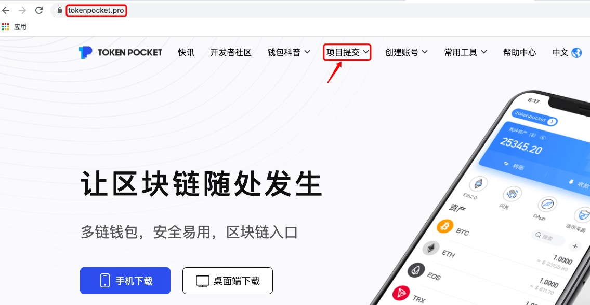
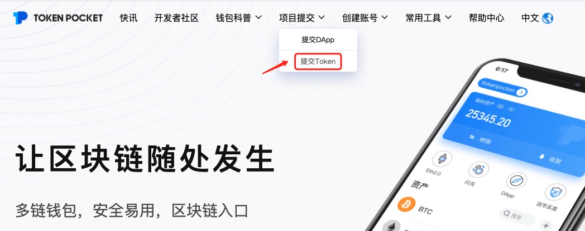
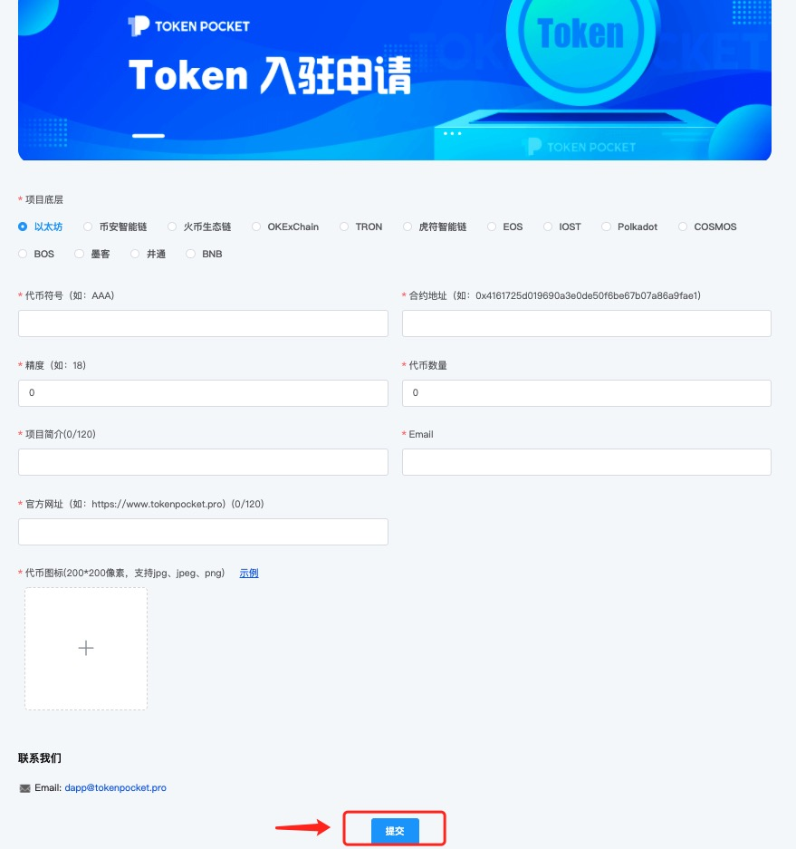

# 如何提交代币？

1、点击链接进入TokenPocket官网：[https://www.tokenpocket.pro/](https://www.tokenpocket.pro/)，点击导航栏【项目提交】；

2、点击【提交Token】；

3、按顺序填写信息，然后点击【提交】即可。  
（注意：代币提交完成后，管理员将会尽快审核您的申请，请耐心等待。）

**相关文章：**  
1）[关于自定义代币](https://tphelp.gitbook.io/cn/wallet-operation/custom-token)  
2）[关于自主提交代币图标](https://tphelp.gitbook.io/cn/wallet-operation/submit-token)

