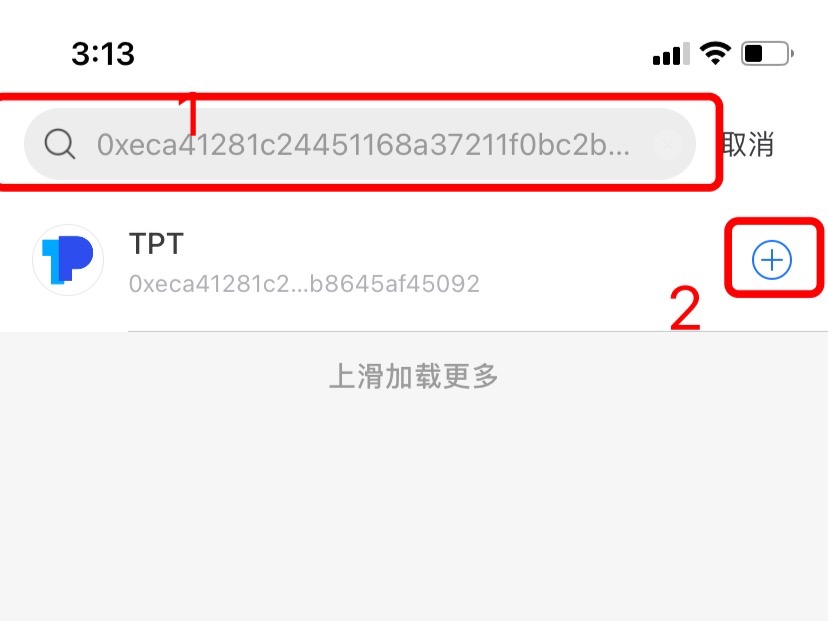

# 如何搜索和添加代币？

1、打开TokenPocket，选择你所需代币的底层钱包后，在【资产】页面点击右上角的搜索栏可快速查找当前已添加的代币，点击【+】可添加新的代币；

2、输入代币的合约地址，然后点击右边的【+】完成添加代币。（此处以添加TPT为例）

**相关文章：**  
[如何更新和提交代币图标？](https://tphelp.gitbook.io/cn/wallet-operation/submit-token)

