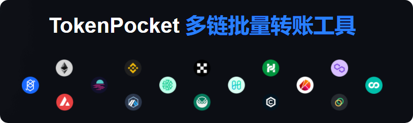

# 多链批量转账工具

#### <mark style="color:blue;">**工具简介：**</mark>

TokenPocket多链批量转账工具，支持ETH、BSC、HECO、OKXChain、Polygon等十几条EVM公链合约批量转账，大大的简化了转账流程，使用费用更低，更方便。

#### <mark style="color:blue;">**VIP服务介绍：**</mark>&#x20;

加入VIP，您可以享受无限次免费批量转账服务。 请注意，您仍需支付转账所需的矿工费。 如果没有使用vip服务，会在每次批量转账时收取单次费用。

#### <mark style="color:blue;">**工具使用注意事項：**</mark>

1.、收款地址和数量必须用英文逗号分隔；

2、推荐使用PC端操作，可以快捷加载文本批量导入地址；（[<mark style="color:blue;">**TokenPocket插件钱包**</mark>](broken-reference)）

3、如往交易所地址进行转账，请务必确认交易所是否支持合约转账，否则你的转账将无法到账。

#### <mark style="color:blue;">**工具使用教程：**</mark>

1、打开多链批量转账工具链接[<mark style="color:blue;">**https://batchsender.tokenpocket.pro/#/**</mark>](https://batchsender.tokenpocket.pro/#/)&#x20;

连接打开后会自动调用TokenPocket插件钱包并选择的需要操作的地址连接。

2、多链批量转账工具支持VIP服务，在主页中点击【加入VIP会员】，根据自己的实际需求来选1天、7天、31天的服务，每项服务的费用都是不同的。

#### 3、准备步骤

选择需要操作的代币，点击列表就可以看到自己持有的代币，也可以直接填入代币合约地址来快速设置。pc端中支持CSV文件的上次，可以快速导入准备好的地址和数量，底部的注意事项也要认真查看。

如果首次使用，可以点击下载模板，编辑好以后点击【上传文件】来进行加载。

#### 4、授权和确认步骤

原生币之外的代币在首次操作的时候都需要进行授权，授权在这里人性化的分为【精准授权】和【无限授权】，用户可以根据自己的需求来进行选择，在【摘要】列表中可以看到当前操作代币的相关信息。

<mark style="color:red;">需要注意的是：批量导入的地址，会按照400个一组（不同公链或代币可能不同）进行分配并发送，所以用户设置地址的时候可以根据这个特性进行优化，尽可能不要浪费矿工费。</mark>

授权完成后，点击底部的【确定】。

#### 5、发送步骤

点击确认后会调用TokenPocket插件钱包进行确认，按照400个地址（不同代币或公链这个参数会不同）一个组进行发送，经过三次确认后就完成了批量操作的所有步骤。

{% embed url="https://1241502402-files.gitbook.io/~/files/v0/b/gitbook-x-prod.appspot.com/o/spaces%2FMr66Ca6n3UR4Xw7gcij2%2Fuploads%2FwKap17aHfxYQ2ILq6r1V%2FSnipaste_2022-05-18_15-19-21.png?alt=media&token=2bd75f25-728b-4917-a608-9e9de187bd20" %}
