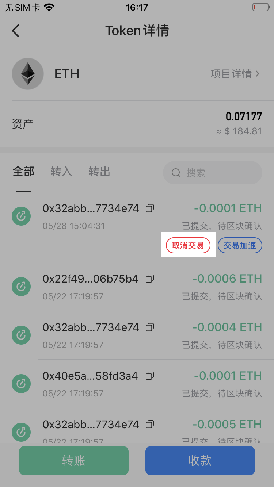
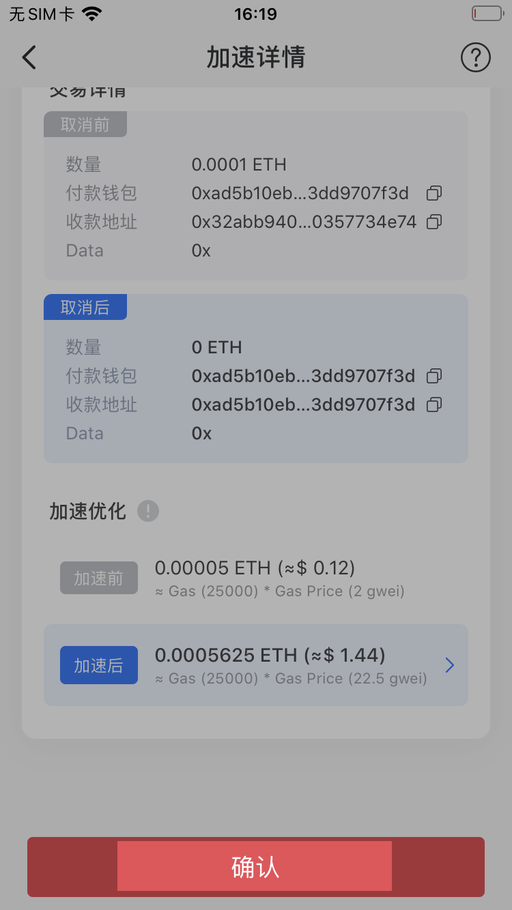
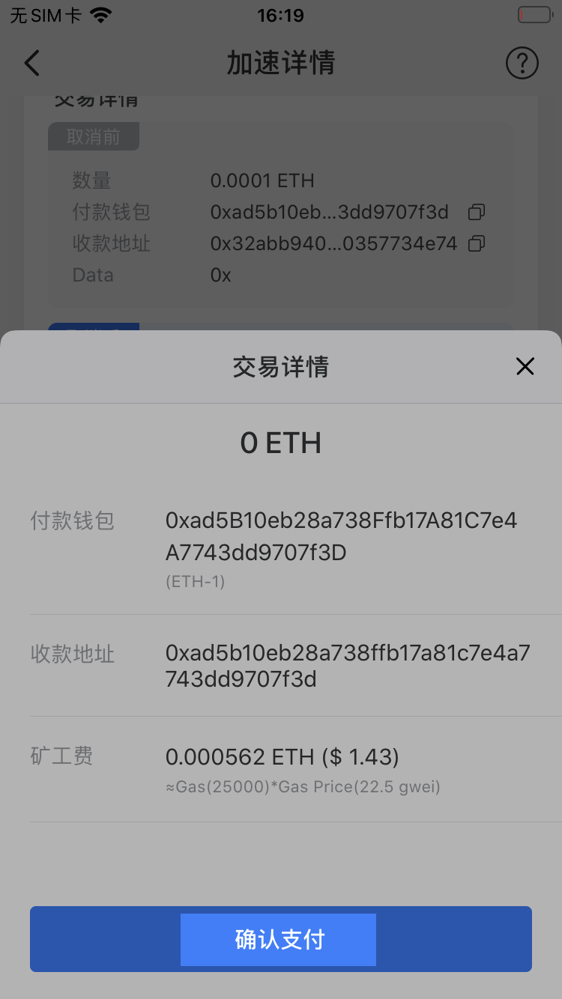
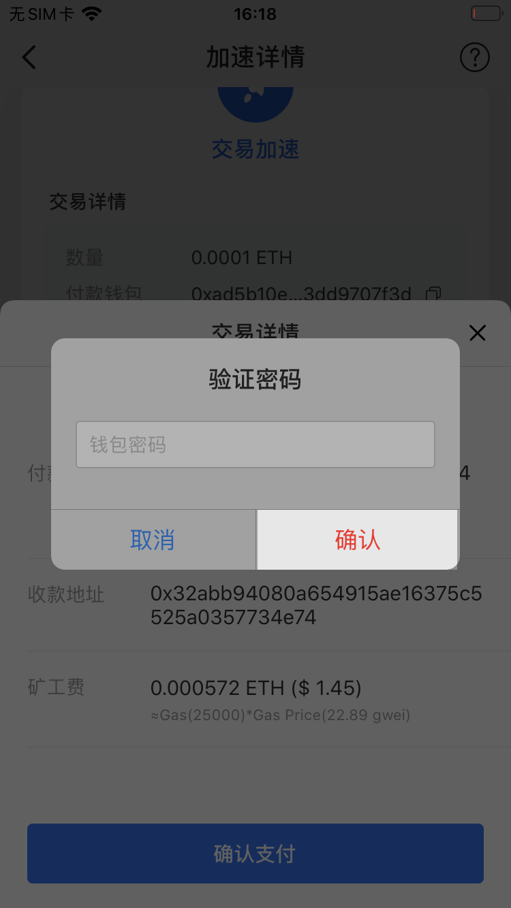
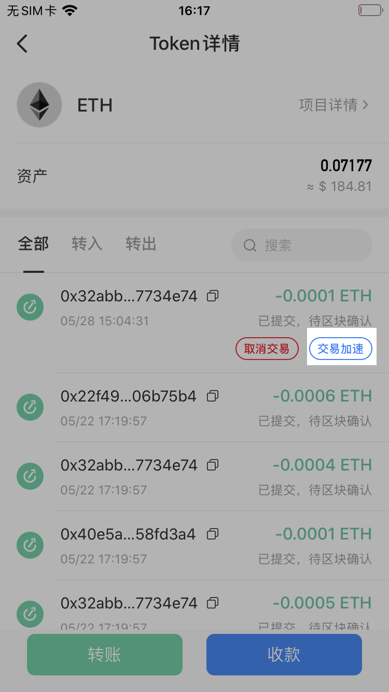
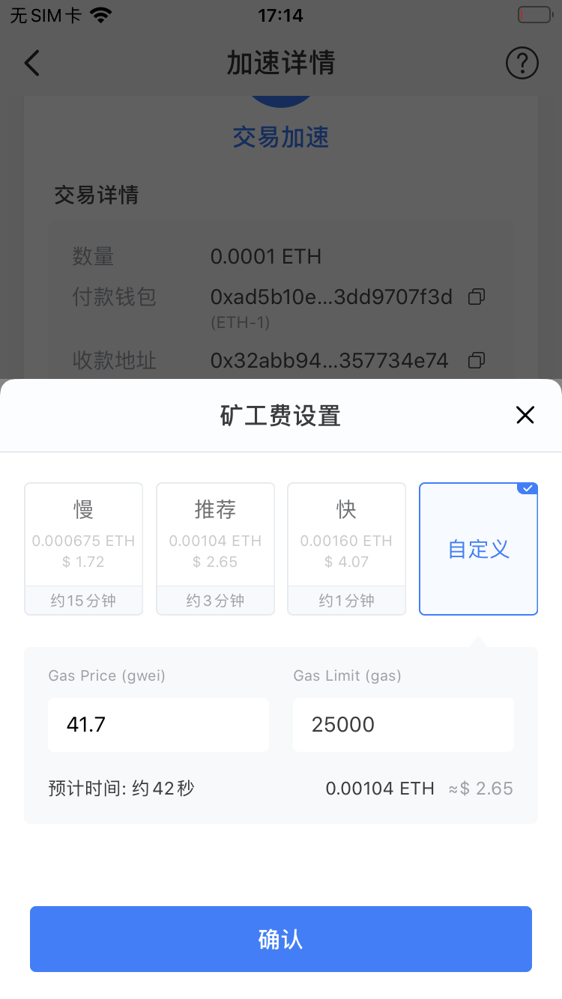
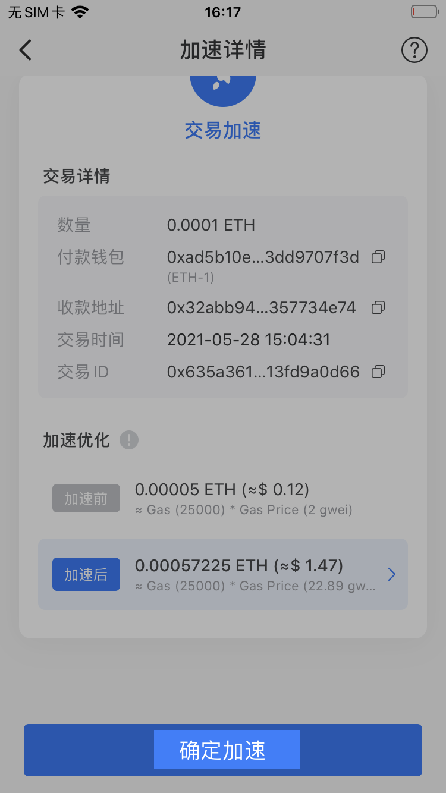
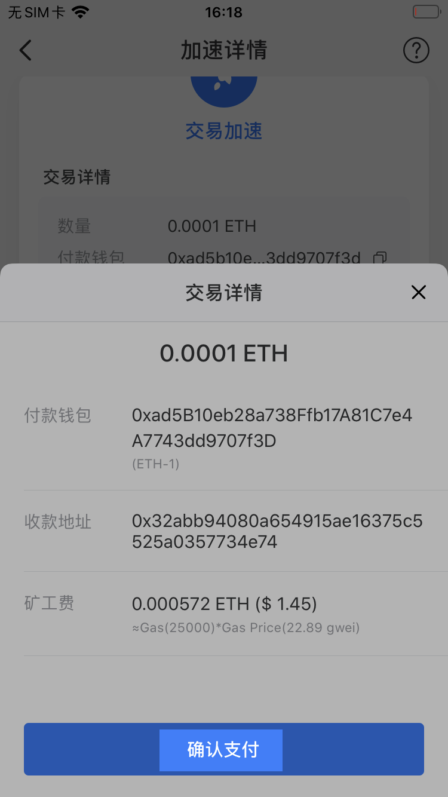

# 如何取消/加速转账交易？

**一、如何取消转账交易？**

1、打开TokenPocket，需要选择需要取消的转账交易，然后点击【取消交易】；（此处以取消ETH转账为例）

注意：一般情况下，以太坊链上的转账比较拥堵，转账仅在未上链前才能取消。

2、进入取消交易的页面后可查看详情，然后点击【确认】；

3、确认交易信息无误后，点击【确认支付】；（注意，取消交易的逻辑为重新发起一笔相同数量的转账到你的原发送地址以此覆盖原来的交易，取消交易需要上链，因此仍需支付少量矿工费。）

4、输入钱包密码后，点击【确认】完成取消转账。

\*\*\*\*

**二、如何加速转账交易？**

1、需要选择需要加速的转账交易，然后点击【交易加速】；（此处以加速ETH转账为例）

2、进入页面后，点击【加速后】一栏可自定义矿工费；

3、根据需求选择矿工费，也可点击【自定义】设置Gas price 和 Gas limit，然后点击【确认】；

4、点击【确定加速】；

5、确认信息无误后，点击【确认支付】；

6、输入钱包密码后，点击【确认】完成交易加速。

  

