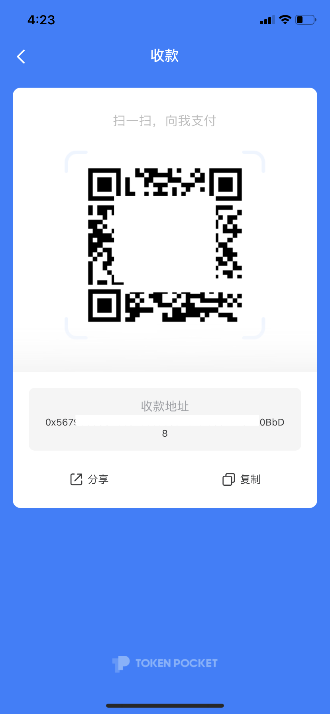

# 如何收款？

1、打开TokenPocket，在【资产】页面选择需要接收的代币；（此处以接收BSC链的TPT为例）

2、点击【收款】；

3、在中心化交易所/去中心化钱包的提现页面上，可通过扫描二维码或复制收款地址到提现地址即可。

**注意：**  
1）在进行任何转账时，请确认选择的转账通道是否一致！  
2）转账到TokenPocket后未显示代币，请先查看是否添加该代币。

**相关文章：**  
1）[如何添加代币](https://tphelp.gitbook.io/cn/token-management/search-and-add-token)  
2）[关于不同公链的代币转账](https://tphelp.gitbook.io/cn/wallet-operation/about-public-chain-transfer)

