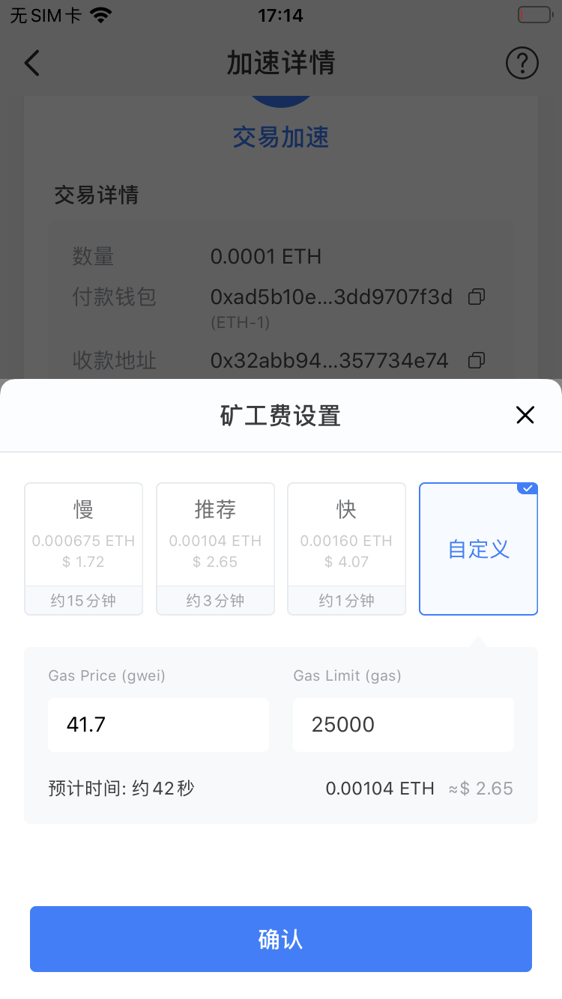
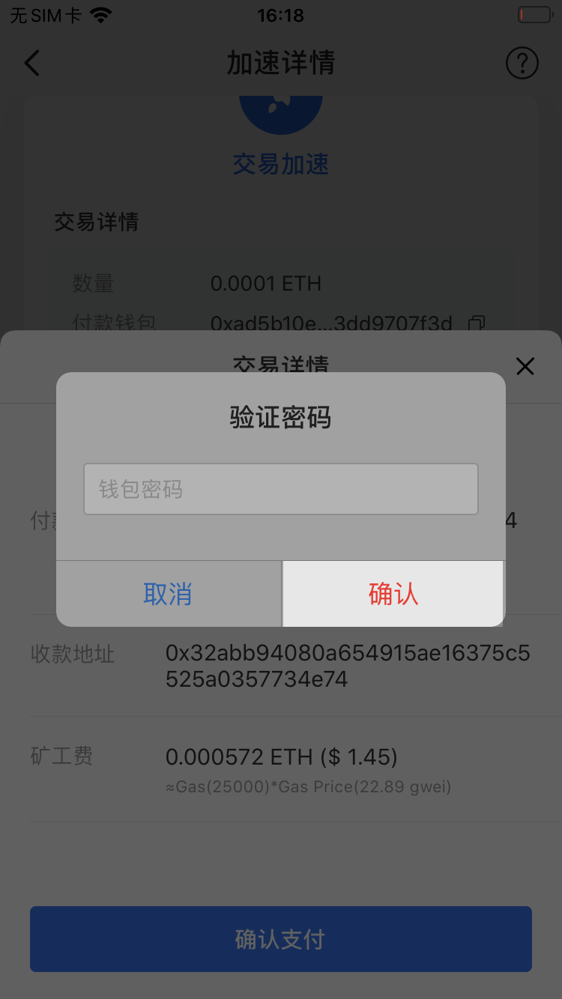

# 如何加速转账交易？

1、需要选择需要加速的转账交易，然后点击【交易加速】；（此处以加速ETH转账为例）

2、进入页面后，点击【加速后】一栏自定义矿工费；

3、根据需求选择矿工费，也可点击【自定义】设置Gas price 和 Gas limit，然后点击【确认】；

提示：由于矿工会优先打包手续费高的交易，因此设置的矿工费越高，则交易加速越快。

4、设置完成后，点击【确定加速】；

  
5、确认信息无误后，点击【确认支付】；

6、输入钱包密码后，点击【确认】完成交易加速。

