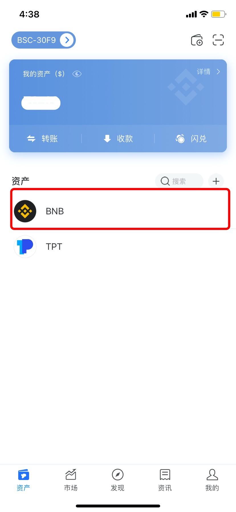
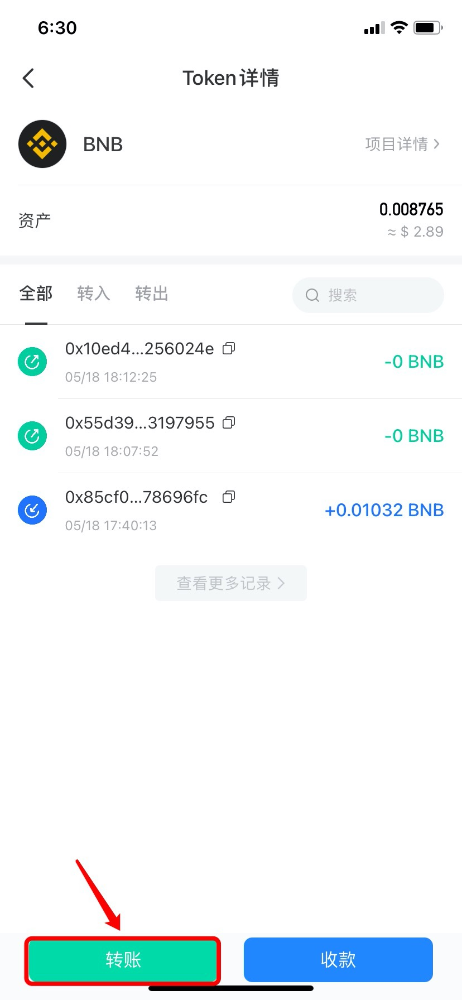
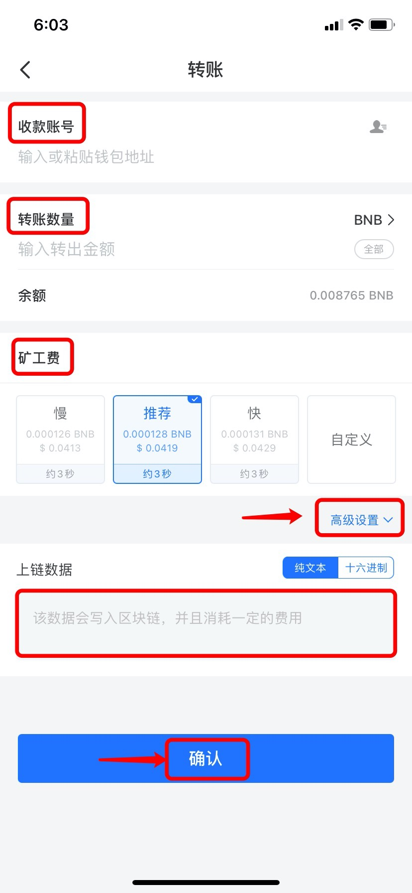

# 如何在发起转账时添加memo？

1、打开TokenPocket，在【资产】页面选择需要转账的原生币；（此处以BNB为例）

注意：一般情况下原生币才能添加memo，例如ETH、BNB、HT等，但是EOS和IOST链上所有Token都可以添加memo。

2、点击【转账】；

3、选择并点击转账方式，此处以选择【直接转账】为例；

4、依次输入【收款账号】和【转账数量】，选择矿工费后，点击右下角【高级设置】，可选择【纯文本】或【十六进制】，然后将需要发送的memo填入，最后点击【确认】。

提示：矿工费可点击【自定义】来自行设置Gas price 和Gas limit。

5、进入下一页面，确认信息无误后，点击【确认支付】，然后输入密码即可转出带memo的转账。

