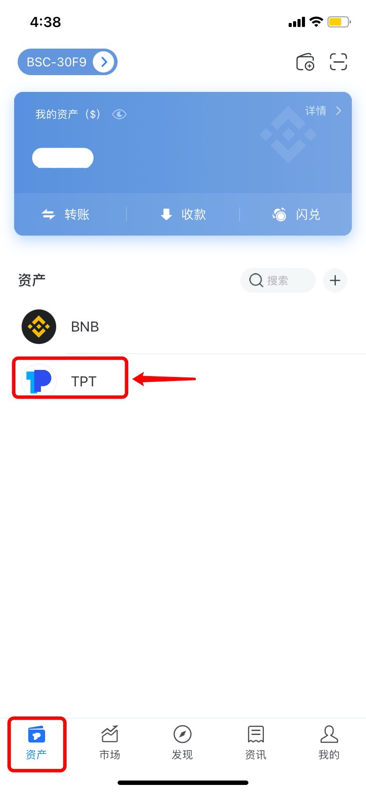
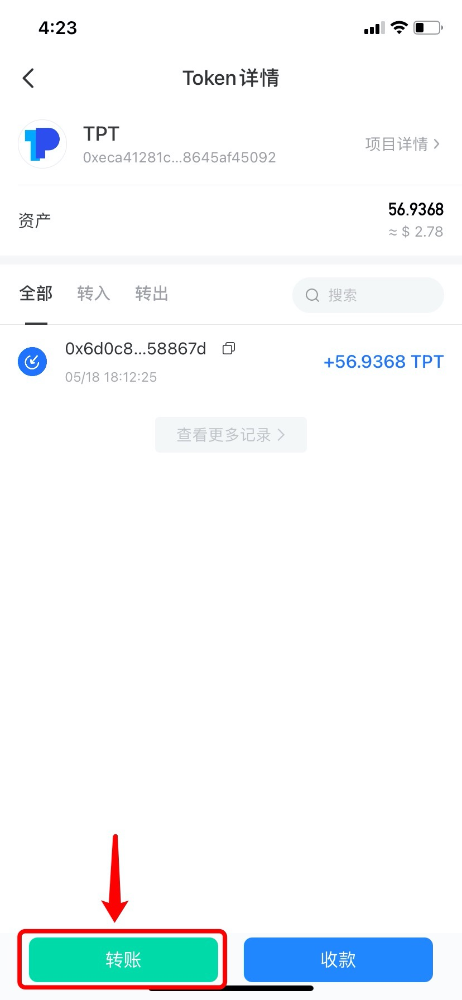
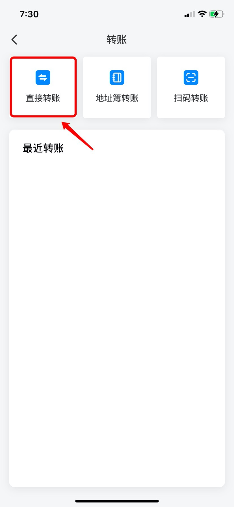
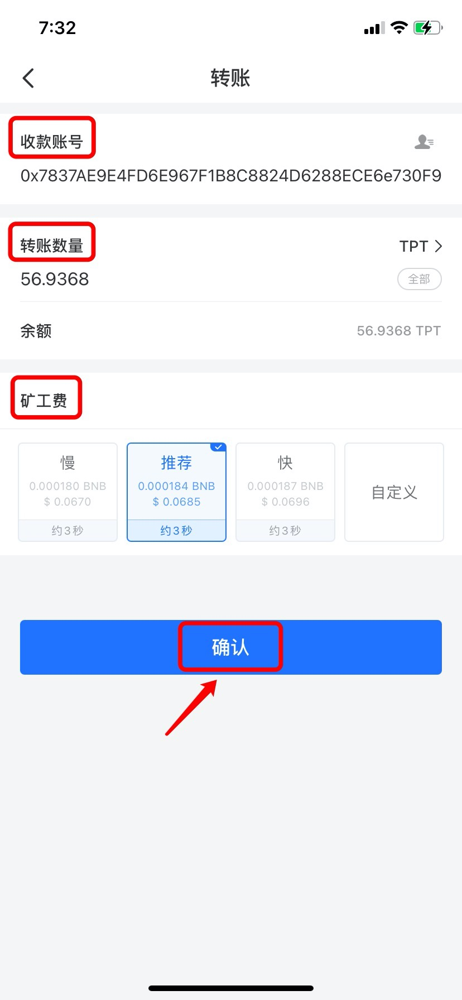
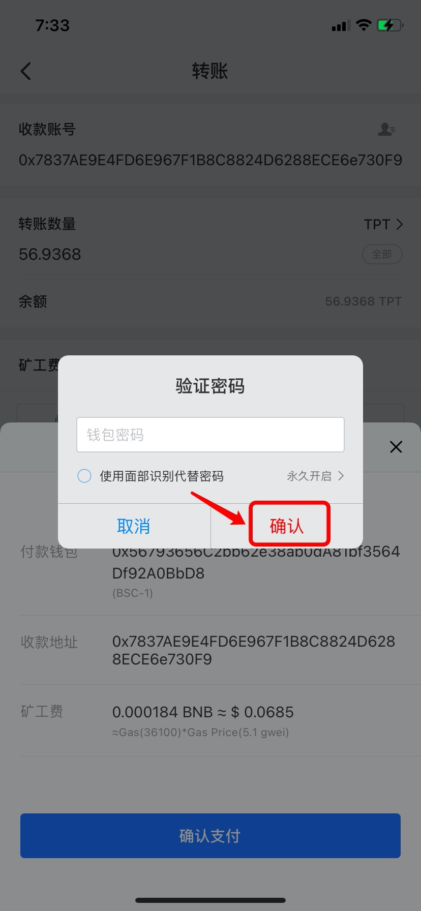

# 如何转账到钱包/交易所？

1、打开TokenPocket，在【资产】页面选择需要提现的代币；（此处以提现BSC链的TPT为例）

2、在底部点击【转账】；

3、选择并点击转账方式；（此处以直接转账为例）

提示：1）点击【地址簿转账】可以直接选择地址簿存储的转账地址；  
2）点击【扫码转账】可以通过扫描接收地址的二维码填写地址。

4、依次填入【收款账号】和【转账数量】，选择矿工费，然后点击【确认】；

**注意：**1）如果是转账到中心化钱包（交易所），接收地址的代币需要附带Memo或者Tag，一定要附加Memo或者Tag。

2）矿工费可选择自定义调节gas price 和gas limit。

5、确认转账信息无误后，点击【确认支付】；

6、输入钱包密码，然后点击【确认】完成转账。

**注意：**  
1）转账前请确保钱包有足够的矿工费，否则将导致转账失败。例如，选择币安智能链转账时，需确保钱包有足够的BNB作为矿工费；  
2）转账时，请确保需要转账的代币与接收地址在同一条公链上。例如，接收地址为BNB-BSC地址，则应选择币安智能链钱包进行转账。

  
**相关文章：**  
1）[关于不同公链的代币转账](https://tphelp.gitbook.io/cn/wallet-operation/about-public-chain-transfer)  
2）[为什么不能直接往合约地址转账？](https://tphelp.gitbook.io/cn/wallet-operation/about-public-chain-transfer/not-transfer-to-contract)  
3）[转账时，转错链了怎么找回资产？](https://tp-lab.tokenpocket.pro/AssetsFind/index.html?locale=zh#/)  
4）[如何添加Memo或者Tag?](https://tphelp.gitbook.io/en/transfer-tutorial/how-to-add-memo-when-transferring)

