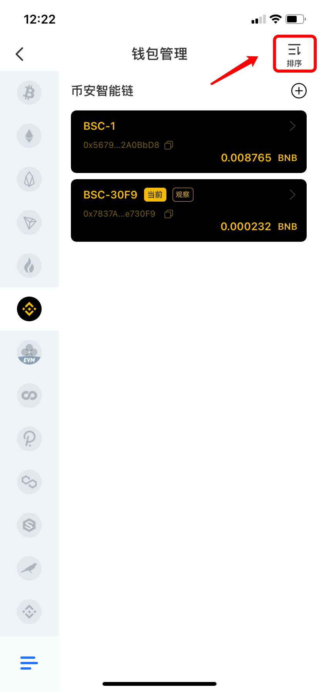
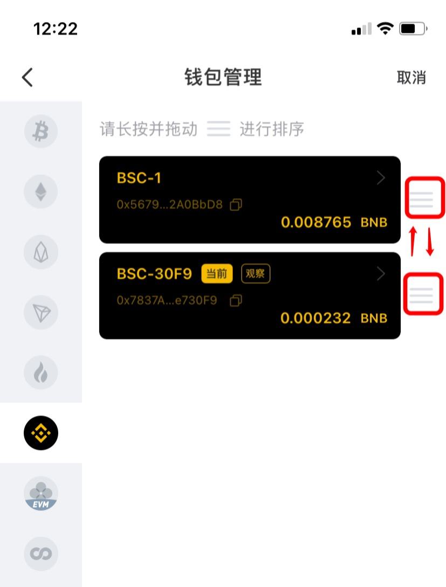
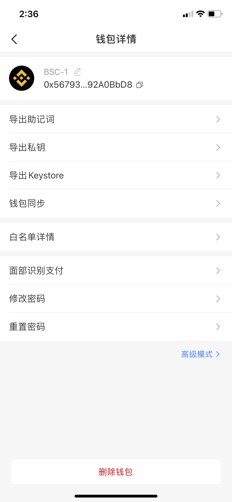
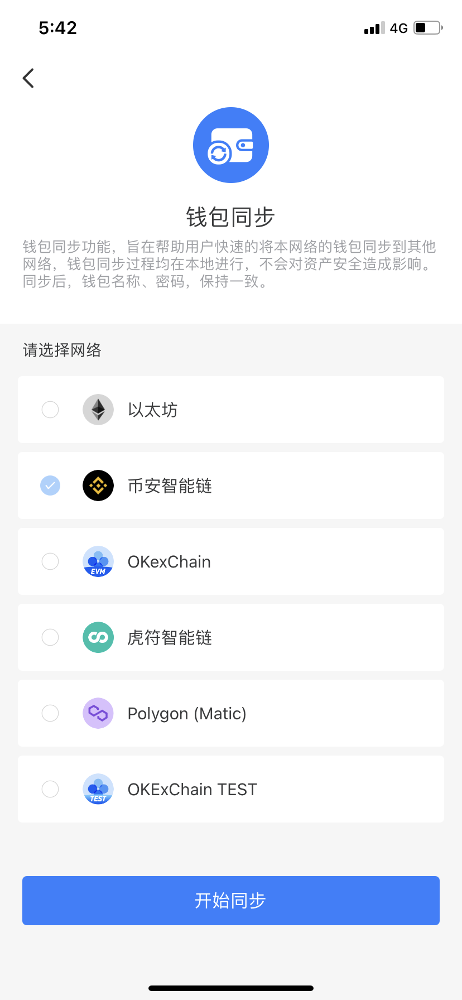

# 如何管理钱包？

1、打开TokenPocket后，点击右下角【我的】- 选择【钱包管理】；

.png>)

2、点击右上角的【排序】按钮可对多个钱包进行排序；

3、长按【排序】按钮并上下拖动进行排序；

4、点击你所需要管理的钱包，进入页面后，可对当前的钱包进行如下操作：\
1）导出当前钱包的助记词/私钥/keystore；请妥善保管这些安全信息，切勿泄漏给任何人；\
2）修改密码可以通过当前的密码进行修改；如忘记当前密码，可点击【重置密码】输入助记词进行重新设置密码；\
3）开启【面部识别支付】后，可进行面部支付转账等操作；\
3）点击【高级设置】可以生成子钱包，请务必备份好助记词，如遗失将无法恢复子钱包；\
4）如进行删除钱包操作，请务必先确保已备份助记词/私钥，否则将无法找回钱包资产！

****\
****5）**钱包同步功能**可以将本网络的钱包同步到其他网络，因此，在转账时，如果不小心选择错误通道而导致资产不到账，可以使用该功能找回资产。具体找回资产的方法请点击[这里](https://tp-lab.tokenpocket.pro/AssetsFind/index.html?locale=zh#/)。

