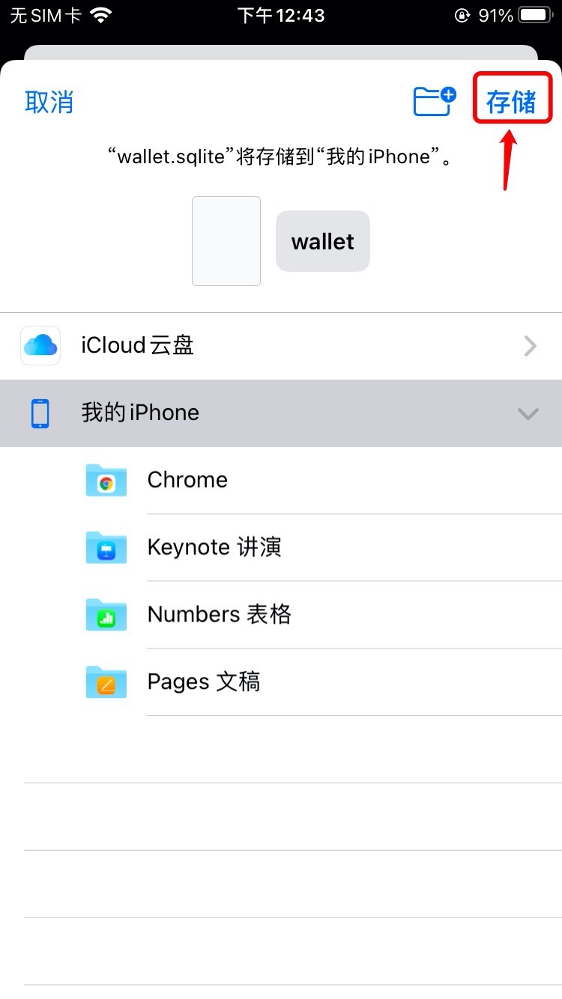
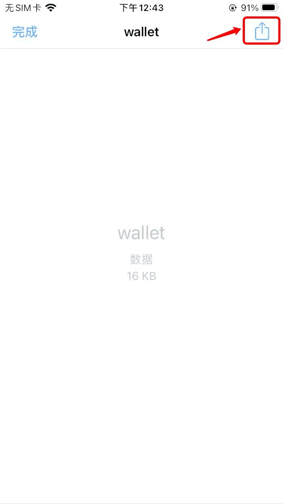
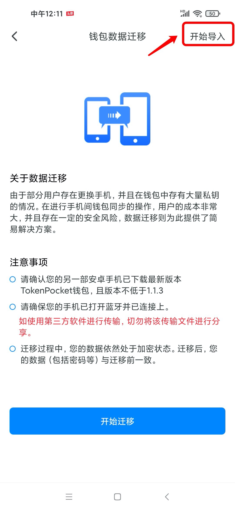
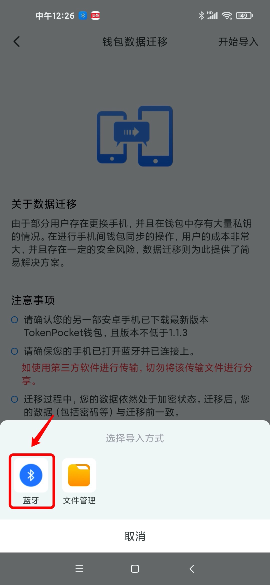

# 如何一键迁移钱包数据？

**关于迁移钱包**\
为了减轻用户在切换APP时重复导入钱包的工作负担，因此我们提供了版本间的数据迁移功能。迁移过程中，数据均处于加密状态，并且仅支持TokenPocket产品之间。

**注意：**\
1）请确保在安全的网络环境下传输钱包数据，且勿分享和发送给任何人；\
2）请在迁移钱包之前，确保原本钱包的私钥/助记词等信息可以安全导出；\
3）不同类型手机无法迁移数据。例如，iOS手机无法迁移TokenPocket数据至安卓手机。

**iOS手机操作步骤：**\
1、打开TokenPocket，点击底部【我的】；

.png>)

2、点击【系统设置】，点击【钱包数据迁移】；

3、点击【开始迁移】；

 (1).png>)

4、如需迁移至**同一设备上**的TokenPocket Pro版本，在弹出的窗口找到并点击【TokenPocket Pro】进行传送即可；

 (1).png>)

5、如需将钱包数据进行迁移到**另一部设备**上，点击【AirDrop】功能传送数据至接收设备；

 (1).png>)

6、在接收设备上点击【使用“文件“打开】；

 (1).png>)

7、点击【存储】；

8、然后点击右上角的【发送】按键；

9、弹出窗口后，找到并点击【TokenPocket】即可完成数据导入。

**注意：在另一设备上成功导入数据后，请将接收的文件删除。**

 (1).png>)

****

****

**安卓手机操作步骤：**\
****1、打开TokenPocket，点击底部【我的】；

 (1).png>)

2、点击【一键迁移】；

.jpg>)

3、点击【开始迁移】；

.jpg>)

4、点击蓝牙进行传送到接收设备；（注意：请确保蓝牙已经打开并成功连接。）

.jpg>)

5、接收设备完成接收后，重新进入TokenPocket，在【数据迁移】页面的右上角点击【开始导入】；

6、选择【蓝牙】即可导入你的钱包数据。

