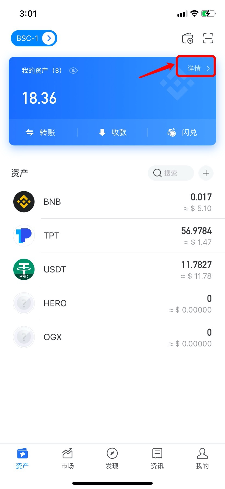
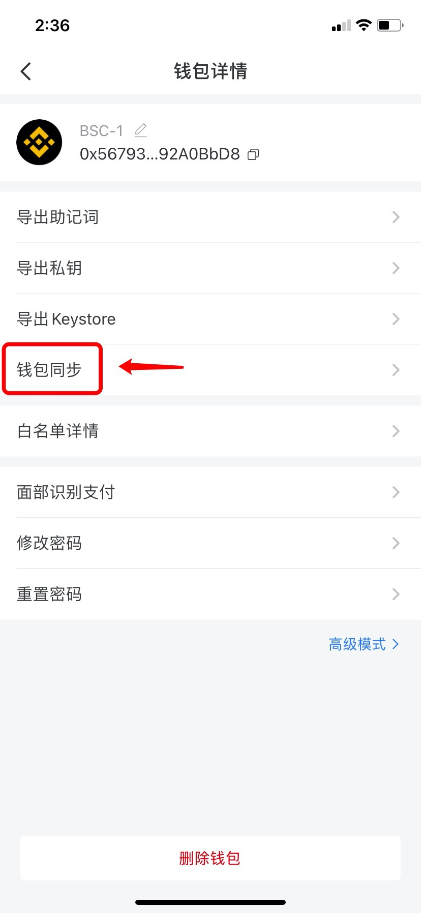
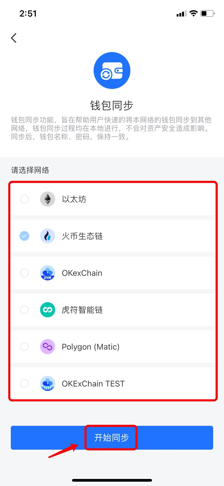
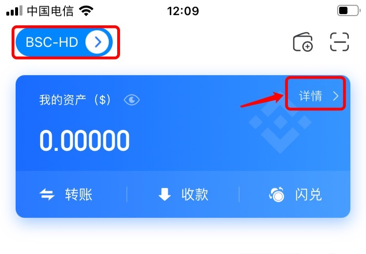

# 如何同步钱包？

钱包同步功能旨在帮助用户快速的将本网络钱包同步到其他网络，钱包同步过程均在本地进行，不会对资产安全造成影响。同步后，钱包名称和密码保持一致。例如，当你转账时使用错误的通道，便可使用该功能找回资产。

1、打开TokenPocket，在【资产】页面点击【详情】进入钱包同步页面（此处以币安智能链网络同步到火币生态链网络为例）；

2、进入钱包管理页面后，点击【钱包同步】；

3、勾选需要同步的钱包后，点击【开始同步】即可完成同步功能。

**注意：**如您的钱包为HD钱包，在【资产】页面点击【详情】进入钱包同步页面。

