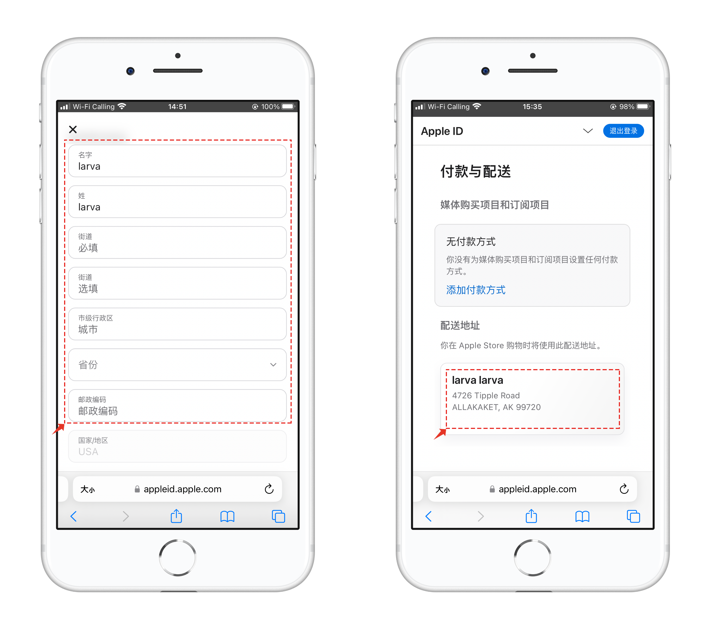

# 如何使用Widget（小部件）

### <mark style="color:blue;">什么是 Widget</mark>

**Widget 不是一个小型的 App**，它是一种新的桌面内容展现形式，主要是用于弥补主应用程序无法及时展示用户所关心的数据。

TokenPocket新版本中支持Widgets功能，可以将我们日常使用的NFT、行情、价格、Gas参数等内容放到手机桌面上。

### <mark style="color:blue;">**Widget两种设置方法，**</mark>

第一种，可以先在TokenPocket中设置选中的NFT作为Widget展示的图片内容，然后通过系统的插件功能来调用。（演示内容使用了第一种方法）

第二种，可以先通过系统插件功能添加行情或者NFT后再点击进入到TokenPocket中设置。

### <mark style="color:blue;">如何设置 Widget</mark>

1、打开TokenPocket，点击【详情】，在钱包详情的右上角点击【设置皮肤】的菜单。

2、在皮肤设置界面中点击【Widgets】，选择自己持有的NFT皮肤中的图片后点击【确认】即可看到设置成功的提示。

.png>)

3、回到手机桌面，长按屏幕选择底部的【插件】功能，在插件详情列表中下拉找到TokenPocket的插件功能。

.png>)

4、添加到桌面后就可以返回桌面并查看效果。只需要点击设置的插件即可自动打开NFT发生界面，做到了方便查看和快捷调用的目的。只需要点击发送就可以设置收款地址和Gas后完成NFT转账操作。

5、TokenPocket插件支持NFT展示、价格展示、Gas参数展示等内容，点击小插件即可快速调用对应的功能，这里的行情展示插件的内容可以在钱包的行情自选中灵活设置。

### <mark style="color:blue;">iOS的设置方法：</mark>

1、打开手机桌面向右滑动屏幕进入桌面小组件界面，选择小组件界面底部的【编辑】功能，在界面右上角点击【+】添加小部件。

<figure><figcaption></figcaption></figure>

2、在添加界面中可以直接通过搜索TokenPocket或者下拉倒底部找到TokenPocket，打开后就可以向左滑动查看支持的8种展示部件，（行情展示部分对部分用户会有限制）

<figure><figcaption></figcaption></figure>

3、添加完成后就可以在小部件的界面中查看和点击使用相关功能，小部件设置的方法iOS和安卓移动端都是一样的。

<figure><figcaption></figcaption></figure>
