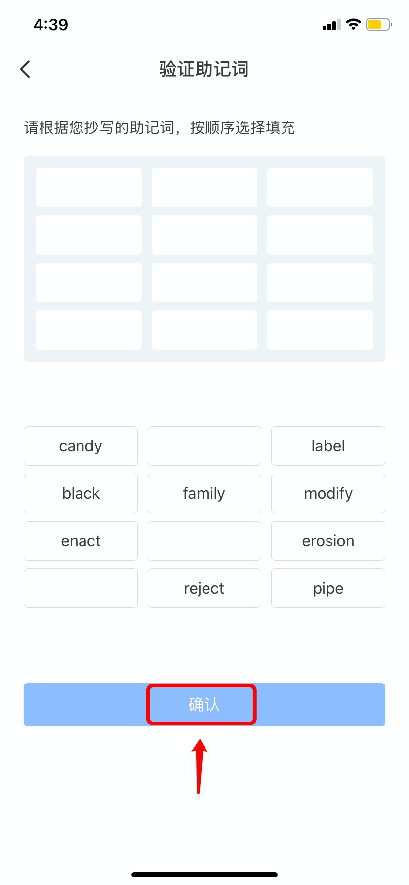

# 如何创建钱包？

1、打开TokenPocket钱包后，点击【我没有钱包】； &#x20;

 (1).png>)

2、选择想要创建的底层钱包；（此处以以太坊钱包为例）

.png>)

3、点击【创建钱包】；

4、依次设置【钱包名】和【密码】，然后勾选【服务及隐私条款】，点击【创建钱包】；

 (2) (1).png>)

5、进入备份助记词页面后，请勿截图助记词，备份后点击【备份完成，进行验证】；

 (2).png>)

6、按照上一步的助记词顺序填入，然后点击【确认】；

7、至此，您的新钱包已经创建成功。

 (1).png>)
