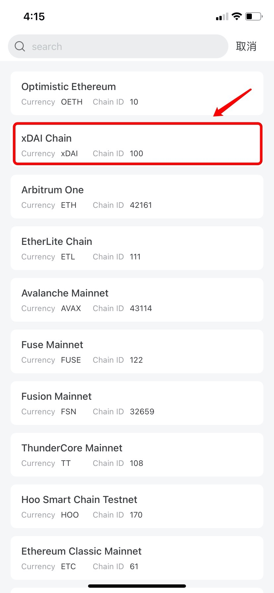

# 如何添加自定义网络？

**关于自定义网络：**

自定义网络是指用户通过TokenPocket钱包，配置相关参数，直接将一条链添加到钱包，以达到钱包原生支持的体验，包括但不仅限于DApp访问，代币添加，交易记录等。

**如何添加自定义网络?**

1、打开TokenPocket钱包，点击右上角第一个图标【添加钱包】；

.png>)

2、列表拉到底部，点击【添加自定义网络】；

3、自定义网络可以自己设置所需参数，也可以点击右上角的【快捷入口】来快速选择所需网络，通过顶部还可以进行搜索，大大的方便了用户四处寻求可用网络节点参数的问题。

4、例如我们选择的xDAI链，选中后可以看到网络数据已经自动填入，只需要点击【保存】即可在列表中看到，通常位于列表的最后一个位置。

.jpg>)

5、点击新添加的xDAI网络，可选择【创建】或【导入】钱包，即可完成自定义网络的快速添加和使用。

**注意：**TokenPocket 无法验证自定义网络的安全性，请仅添加可信任的网络。\

**相关链接：**\
****[1. 如何创建钱包？](https://tphelp.gitbook.io/cn/wallet-management/create-wallet)

[2. 如何导入钱包？](https://tphelp.gitbook.io/cn/wallet-management/import-wallet)

[3. 自定义网络推广链接](https://tphelp.gitbook.io/cn/wallet-operation/customize-network-add-link)

[4. 如何删除自定义网络？](https://tphelp.gitbook.io/cn/wallet-operation/ru-he-shan-chu-zi-ding-yi-wang-luo)
