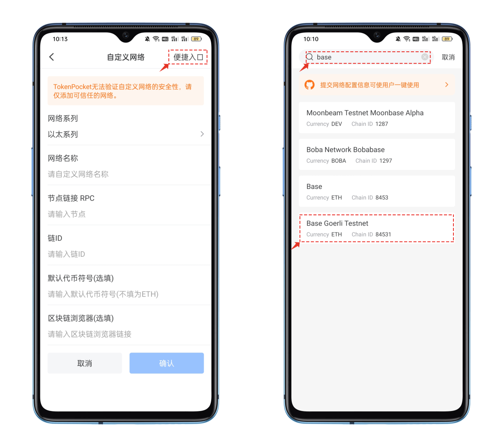
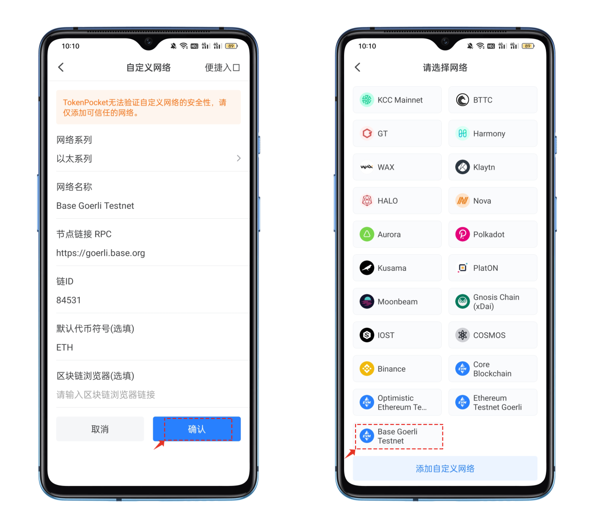
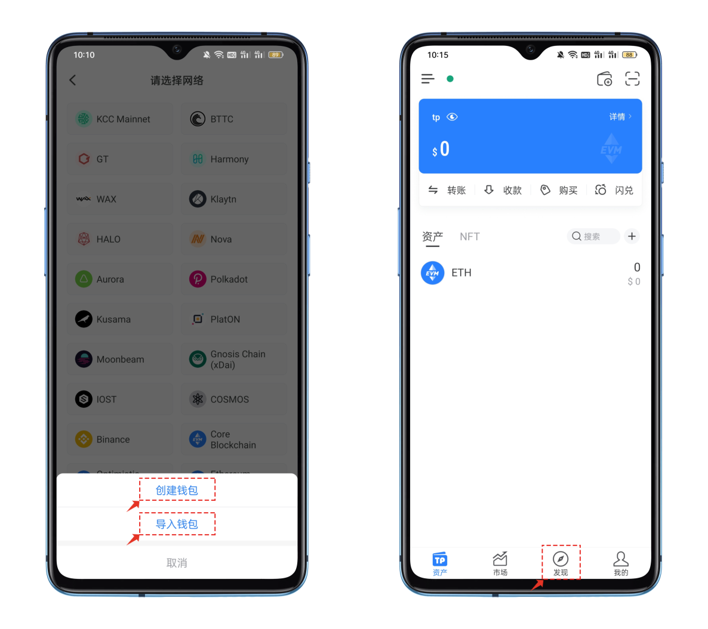

# 如何添加自定义网络

**关于自定义网络：**

自定义网络是指用户通过TokenPocket钱包，配置相关参数，直接将一条链添加到钱包，以达到钱包原生支持的体验，包括但不仅限于DApp访问，代币添加，交易记录等。

**如何添加自定义网络**

1、打开TokenPocket，点击右上角.png>)位置【添加钱包】，在选择网络界面中点击最底部的【添加自定义网络】。

<figure><figcaption></figcaption></figure>

2、在自定义网络编辑界面中，点击右上角的【便捷入口】，在打开界面顶部填入关键词base，选择正确的公链。

<figure><figcaption></figcaption></figure>

3、点击Base Goerli公链后会看到下面的参数提示：点击右下角【确认】即可完成新增自定义网络的操作。

<figure><figcaption></figcaption></figure>

4、点击新增网络，可以看到【创建钱包】和【导入钱包】两个选项，可以根据自己的实际需求来创建或导入Base Goerli 公链钱包。

<figure><figcaption></figcaption></figure>

**注意：**TokenPocket 无法验证自定义网络的安全性，请仅添加可信任的网络。\

**相关链接：**\
[1. 如何创建钱包？](https://tphelp.gitbook.io/cn/wallet-management/create-wallet)

[2. 如何导入钱包？](https://tphelp.gitbook.io/cn/wallet-management/import-wallet)

[3. 自定义网络推广链接](https://tphelp.gitbook.io/cn/wallet-operation/customize-network-add-link)

[4. 如何删除自定义网络？](https://tphelp.gitbook.io/cn/wallet-operation/ru-he-shan-chu-zi-ding-yi-wang-luo)
