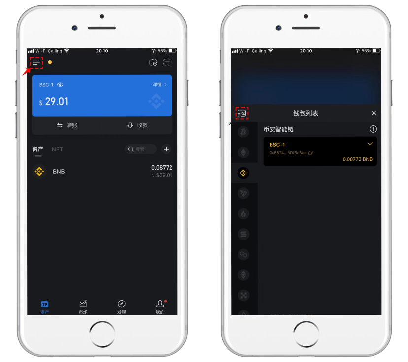
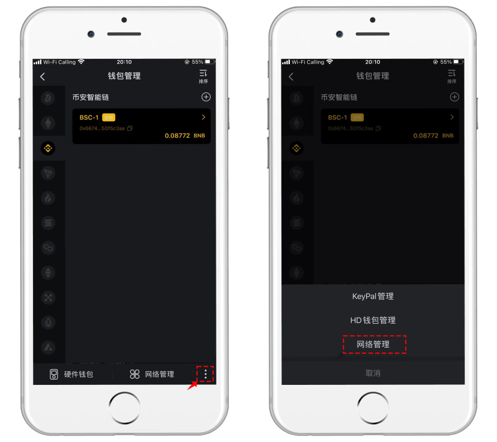
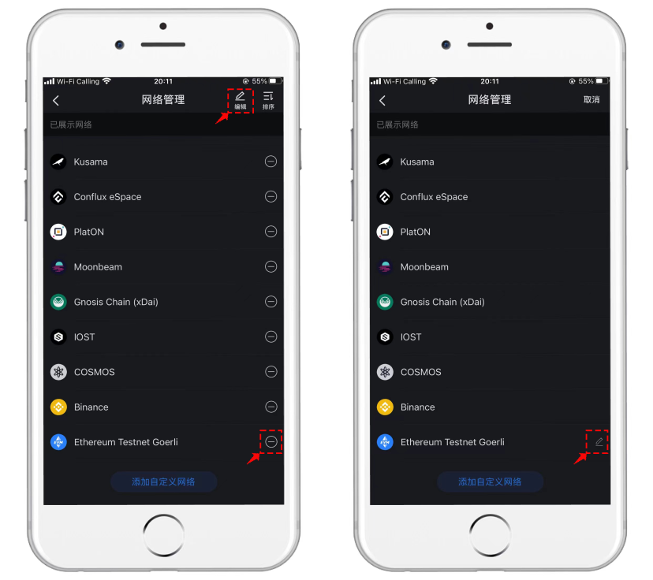

# 如何编辑自定义网络

新增自定义网络后，会在网络选择列表中多出自定义网络的名称，当我们想去掉这个自定义网络的时候应该怎么操作呢？

1、打开TokenPocket，点击左上角 (1).png>)菜单，打开【钱包列表】后，点击左上角 (2).png>)菜单。

<figure><figcaption></figcaption></figure>

2、进入到钱包管理界面有，点击右下角的 (3).png>)菜单，在弹出的菜单中选择【网络管理】。

<figure><figcaption></figcaption></figure>

3、网络管理中，可以点击减号来隐藏不需要使用的公链，但是这里隐藏后并不是删除的作用。如果需要编辑或删除自定义网络需要点击右上角的【编辑】菜单，然后可以看到一个可以编辑的标记。

<figure><figcaption></figcaption></figure>

4、点击.png>)后，可以看到自定义网络的界面，在这个界面中可以对导入过的参数进行修改，也可以点击左下角的【删除】功能，点击后弹出是否删除自定义网络的提示，点击【确认】后，这个导入的自定义网络就会被彻底删除。

<figure><figcaption></figcaption></figure>
