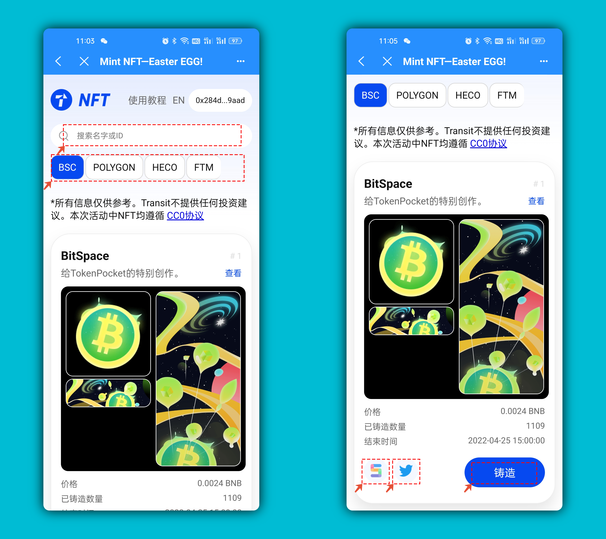
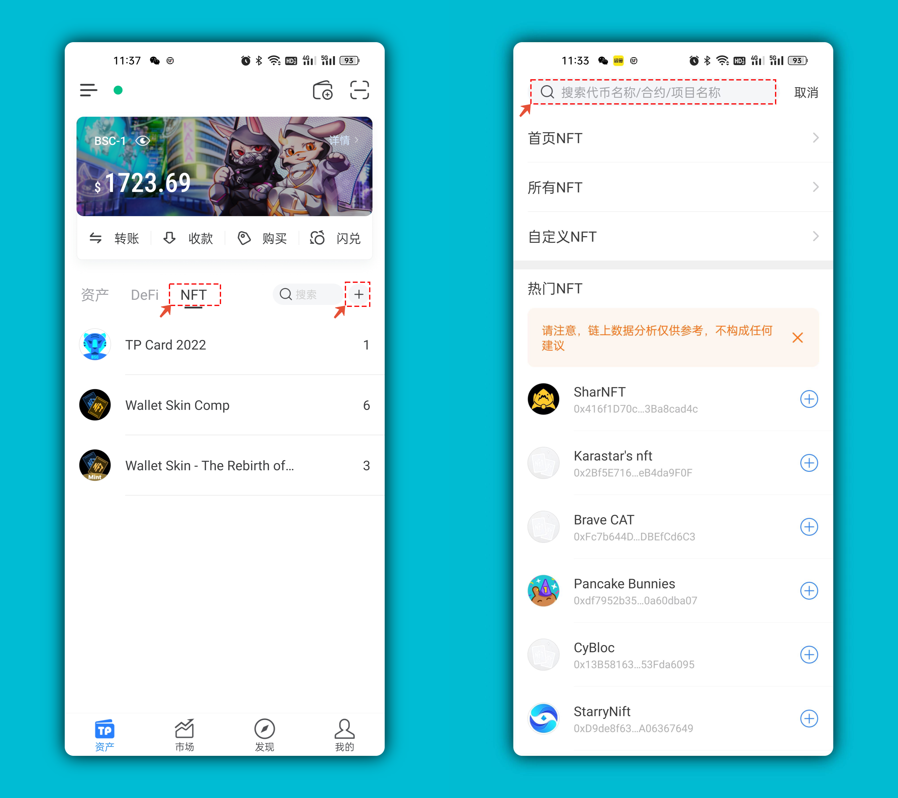
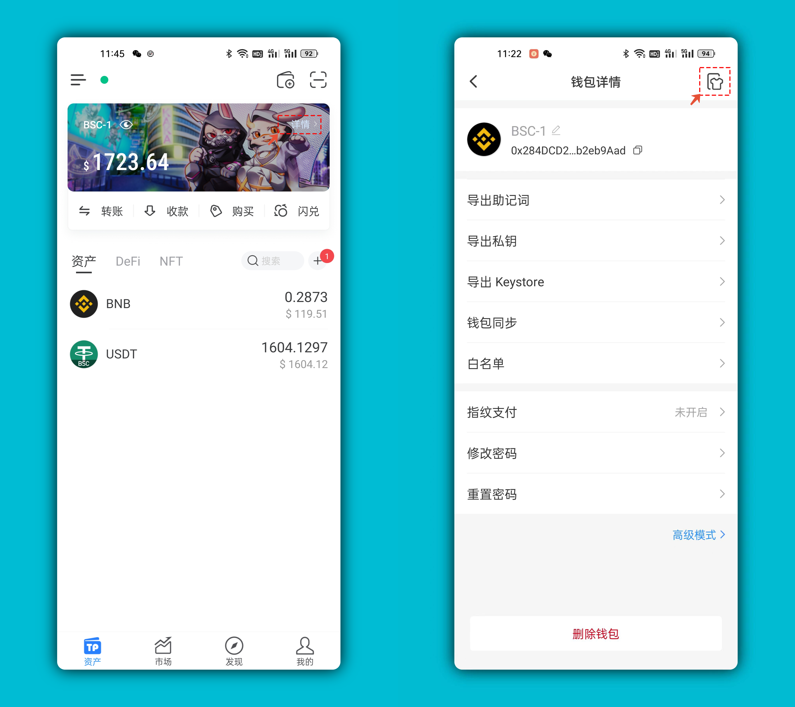
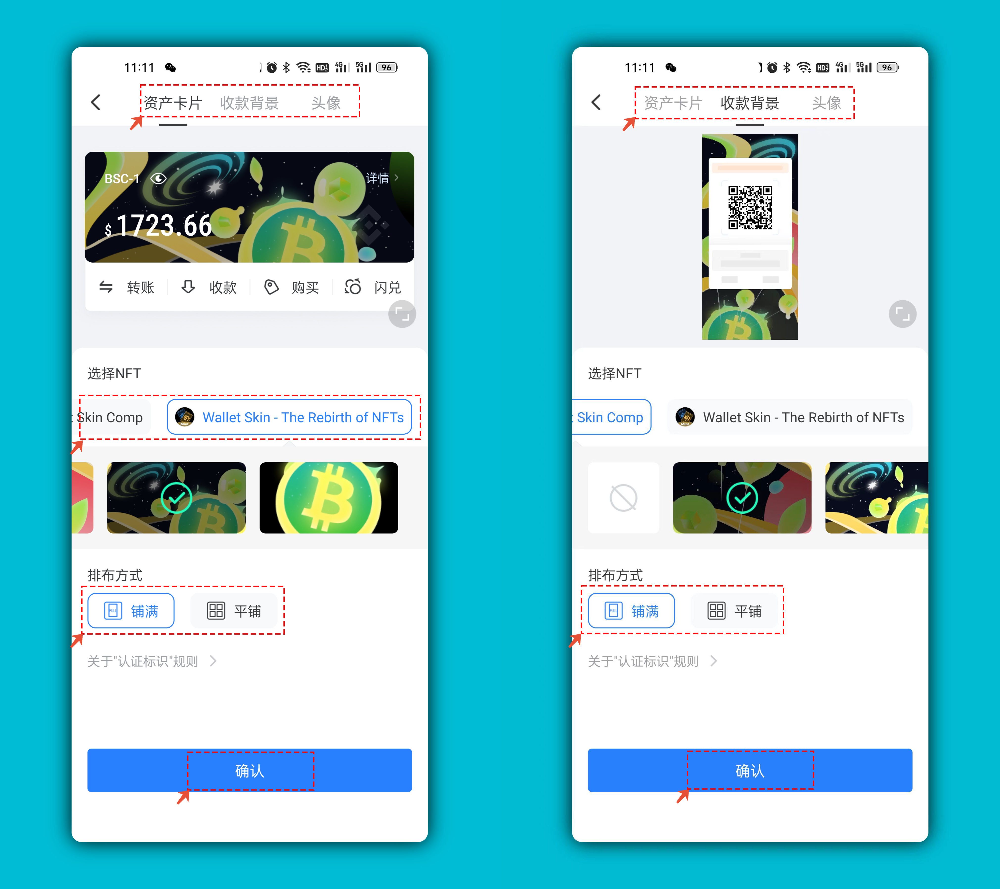

# NFT皮肤赛使用教程

1、打开TP钱包，点击【发现】在新品区或推荐位打开DApp，如果是iOS用户，可以直接[**使用链接**](https://tp-lab.tokenpocket.pro/mint-skin-2/index.html?utm\_source=tokenpocket#/)打开访问。

.png>)

2、铸造界面中，可以填入名称搜索，可以选择不同的公链，找到心仪的皮肤后，可以通过5度来互相取的关注，也可以到作者的推特上查看更多信息，点击【铸造】开始授权。

3、在【交易详情】界面中可以灵活的设置矿工费，BSC链的矿工费比较稳定，所以可以默认选择，或者使用更高的矿工费让交易更快完成。

.png>)

4、完成授权后，回到钱包资产界面，点击【NFT】菜单，点击右侧的【+】来通过顶部的搜索栏，填入NFT合约地址来添加Mint的皮肤。（后续会支持持有NFT代币自动显示以及NFT皮肤界面中添加合约地址）&#x20;

**合约地址：0x749ca2666D20d659c25952f8FAa249eC5Ae72189**

5、添加完NFT代币后返回资产界面，点击界面右上方【详情】，点击右上角的【皮肤设置】入口进行皮肤设置。

6、皮肤设置支持：【资产卡片】【收款背景】【头像】三个位置，选择需要设置的NFT，找到喜欢的背景来进行铺满或平铺，获取到最佳效果后点击确定即可完成。

