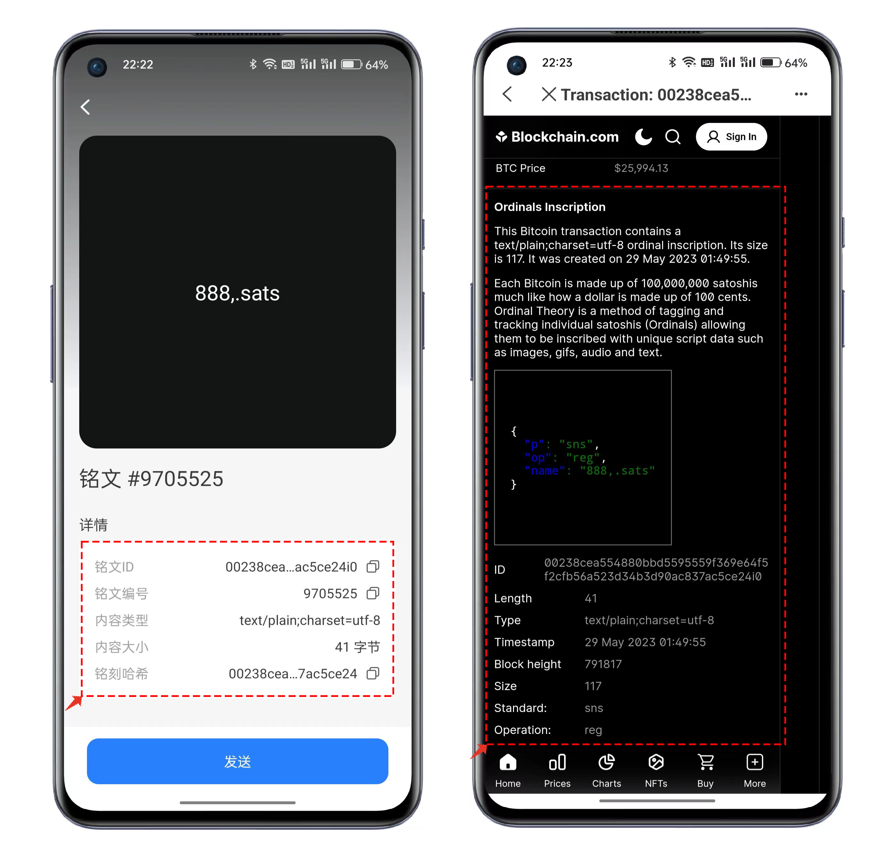

# TokenPocket带您一文玩转EthereumFair（分叉链）

### 如何在TokenPocket创建 EthereumFair 公链。

1、打开TokenPocket，点击右上角添加钱包，在【选择网络】界面中点击最下方的【添加自定义网络】

<figure><figcaption></figcaption></figure>

2、打开自定义网络界面，点击右上角【便捷入口】，TokenPocket会针对比较热门的公链进行收录，通过便捷入口就可以很方便的搜索到自己需要添加的公链。

在搜索栏中填入ETF简称，可以看到下方的搜索结果，点击准备添加。

<figure><figcaption></figcaption></figure>

3、核对信息后点击右下角的【保存】，即可添加成功。回到选择网络界面，下拉到最底部可以看到新添加的EthereumFair网络。

<figure><figcaption></figcaption></figure>

4、点击新增加的EthereumFair 公链，可以选择【创建】或【导入】方式使用ETF钱包，导入后就可以看到自己收到的ETF空投。

<figure><figcaption></figcaption></figure>
