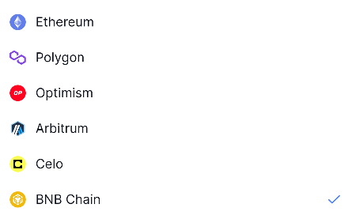
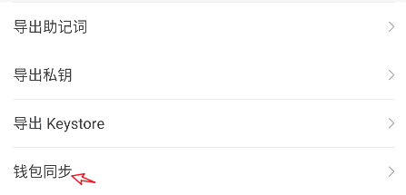

# TokenPocket带您一文玩转CORE

### 如何在TokenPocket移动端添加CORE网络 

1、打开TokenPocket，点击右上角位置【添加钱包】，在宣传网络界面中点击最底部的【添加自定义网络】。

<figure><figcaption></figcaption></figure>

2、在自定义网络编辑界面中，点击右上角的【便捷入口】，在打开界面顶部填入关键词CORE，选择正确的公链。

<figure><figcaption></figcaption></figure>

3、点击CORE公链后会看到下面的参数提示：

* 网络名称: Core Blockchain
* 节点链接 RPC URL: [https://rpc.coredao.org/](https://rpc.coredao.org/)
* 链 ID：1116
* 默认代币: CORE
* 区块链浏览器 URL: [https://scan.coredao.org](https://scan.coredao.org/)

点击右下角【确认】即可完成新增自定义网络的操作。

<figure><figcaption></figcaption></figure>

4、点击新增网络，可以看到【创建钱包】和【导入钱包】两个选项，可以根据自己的实际需求来创建或导入CORE公链钱包。

<figure><figcaption></figcaption></figure>

**除了常规的【创建和导入钱包】，还可以使用TokenPocket的钱包同步功能来快速完成其他EVM公链的同步操作，方法如下：**

* 打开TokenPocket，点击蓝色卡牌的右上角【详情】

<figure><figcaption></figcaption></figure>

* 选择【钱包同步】，在钱包同步界面中下拉找到需要同步的公链后勾选，然后点击【开始同步】即可完成钱包同步的操作。

<figure><figcaption></figcaption></figure>

### 如何在TokenPocket插件端添加Core网络

1.点击左上角切换网络，点击【自定义 RPC】，选择右上方【快捷加链】。

<figure><figcaption></figcaption></figure>

2.在搜索栏输入【Core】，找到下方Core Blockchain， 点击【 Connect Wallet】连接你想要同步至Core网络的钱包，点击【Add to TokenPocket】,即可成功添加Core网络。

<figure><figcaption></figcaption></figure>
