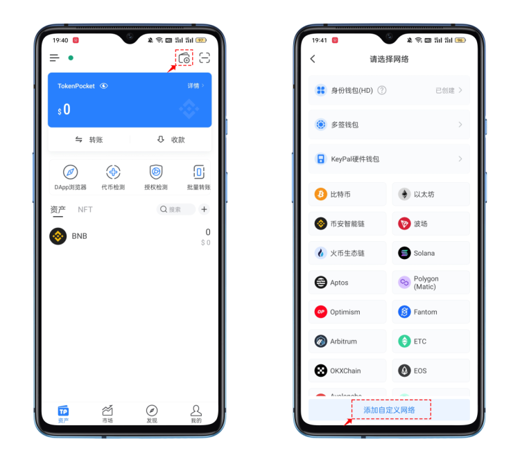
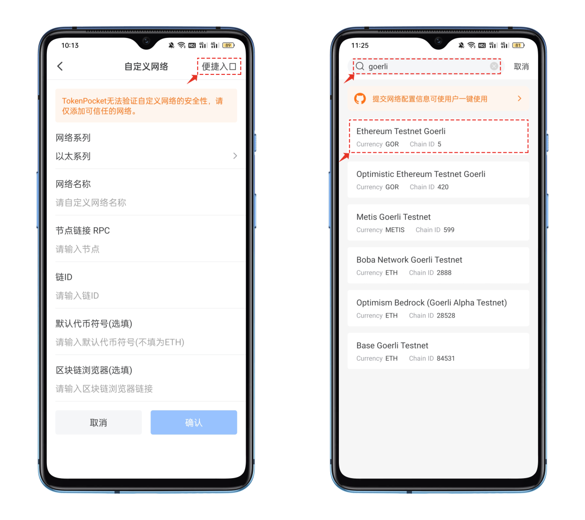
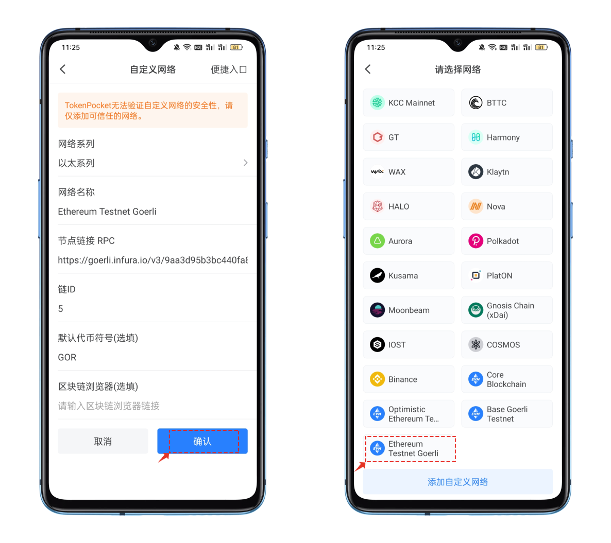
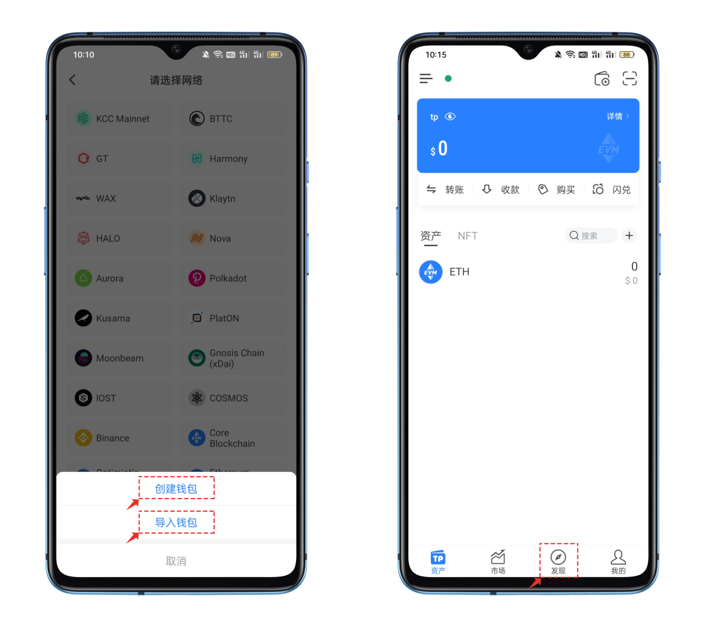
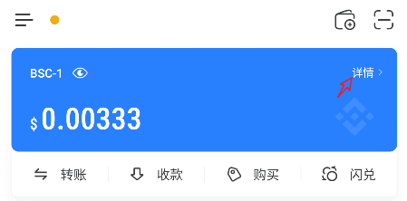

# TokenPocket带您一文玩转 Goerli

<mark style="color:orange;">在</mark><mark style="color:orange;">**TokenPocket添加Goerli 测试网络**</mark>

1、打开TokenPocket，点击右上角.png>)位置【添加钱包】，在选择网络界面中点击最底部的【添加自定义网络】。

<figure><figcaption></figcaption></figure>

2、在自定义网络编辑界面中，点击右上角的【便捷入口】，在打开界面顶部填入关键词goerli，选择正确的公链。

<figure><figcaption></figcaption></figure>

3、点击goerli公链后会看到下面的参数提示：点击右下角【确认】即可完成新增自定义网络的操作。

<figure><figcaption></figcaption></figure>

4、点击新增网络，可以看到【创建钱包】和【导入钱包】两个选项，可以根据自己的实际需求来创建或导入Goerli 公链钱包。

<figure><figcaption></figcaption></figure>

**除了常规的【创建和导入钱包】，还可以使用TokenPocket的钱包同步功能来快速完成其他EVM公链的同步操作，方法如下：**

\
打开TokenPocket，点击蓝色卡牌的右上角【详情】

<figure><figcaption></figcaption></figure>

选择【钱包同步】，在钱包同步界面中下拉找到需要同步的公链后勾选，然后点击【开始同步】即可完成钱包同步的操作。

<figure><figcaption></figcaption></figure>
