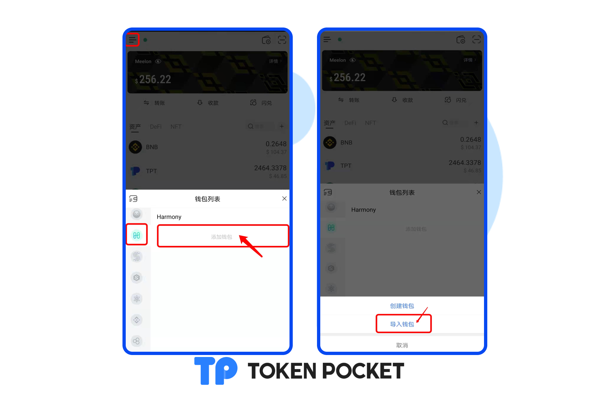

# TokenPocket带您一文玩转Harmony

<mark style="color:orange;">**如何在TokenPocket创建Harmony钱包？**</mark>

1.打开TokenPocket App，点击左上角切换钱包底层，然后选择Harmony，点击【添加钱包】；点击【创建钱包】；

2.继续点击【创建钱包】，设置钱包名称及密码，勾选用户协议，点击【创建钱包】。

.png>)

3.备份助记词，备份好您的助记词，并保存在安全的地方，备份完成后，点击【备份完成，进行验证】，按顺序填入备份好的钱包助记词，点击【确认】。至此，您已成功创建Harmony钱包。

<mark style="color:red;">**注意：请勿把助记词和私钥泄漏给第三方！**</mark>

<mark style="color:red;">****</mark>

<mark style="color:orange;">**如何在TokenPocket导入Harmony钱包？**</mark>

1、打开TokenPocket App，点击左上角切换钱包底层，然后选择Harmony，点击【导入钱包】；点击【私钥导入】或【助记词导入】；

2、此处以【助记词导入】为例，输入您备份的钱包助记词，并输入钱包名称和密码，勾选用户协议，点击【导入钱包】。至此，您已成功导入Harmony钱包。

<mark style="color:orange;">**如何在TokenPocket同步Harmony钱包？**</mark>

钱包同步功能旨在帮助用户快速的将本网络钱包同步到其他网络，钱包同步过程均在本地进行，不会对资产安全造成影响。同步后，钱包名称和密码保持一致。例如，当你转账时使用错误的通道，便可使用该功能找回资产。

1、打开TokenPocket App，点击左上角切换钱包底层，然后选择Harmony，点击右上角【添加钱包】，点击【创建钱包】；

2、点击【一键同步】，勾选您所需要同步的钱包网络，点击【开始同步】即可完成。

<mark style="color:red;">**注意：为保证您的资金安全，请勿将助记词或私钥透露给任何人！**</mark>
