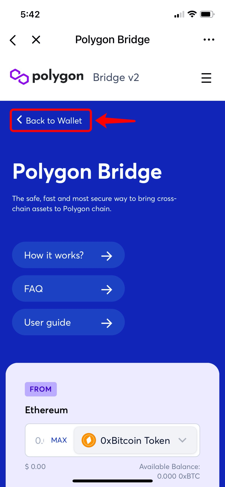

# 如何在TokenPocket玩转Polygon（Matic）?

**关于**[**Polygon（Matic）**](https://polygon.technology/)****

目前，TokenPocket已经支持Polygon（原Matic），用户在TokenPocket即可创建并体验Polygon（Matic）。Polygon的愿景是建造以太坊的区块链互联网，它提供了一个通用框架，允许开发人员利用以太坊安全性创建定制的，专注应用程序的链，并提供一个可互操作的网络，将各种不同的扩展解决方案链接在一起，例如Layer 2 的扩容方案Rollups和侧链等。

****

**如何在TokenPocket创建Polygon（Matic）？**

1、打开TokenPocket App，点击左上角切换钱包底层，然后选择Polygon （Matic），点击【添加钱包】；

.png>)

2、点击【创建】，继续点击【创建钱包】；

.png>)

3、依次设置【钱包名】和【密码】，然后勾选【服务及隐私条款】，点击【创建钱包】；然后开始备份助记词，点击【备份完成，进行验证】；

注意：请勿将助记词透露给任何人！

 (2).png>)

4、按照顺序验证助记词，然后点击【确认】，至此，你已经成功添加Polygon（Matic）钱包。

.png>)

****

**如何在TokenPocket上使用Polygon Bridge和xPollinate？**

**关于**[**Polygon Bridge**](https://wallet.matic.network/bridge/)****\
****如果要将资金从**以太坊**转到Polygon，必须经过所谓的“桥“，而“桥“通过锁定和铸造机制来工作。在Polygon上，用户可以选择使用两个桥：**Plasma Bridge**和**PoS Bridge**。Plasma Bridge从以太坊主链继承安全性，但是赎回过程需要7天。PoS桥由同一组验证者和质押的MATIC来保护链本身的安全，因此赎回时间较短，约为三个小时。

**关于**[**xPollinate**](https://www.xpollinate.io/)\
支持Polygon、BSC、xDAI三条链上的资金互转，可将**BSC支持的资产**转移到Polygon与xDAI上，目前只支持跨稳定币。

以下为详细步骤：

**如何使用Polygon Bridge将以太坊资产跨链至Polygon ?**

1、在TokenPocket底部点击【发现】，然后顶部搜索【Polygon Bridge】**；**

2、点击【Polygon Bridge】；（此处需科学上网）

3、选择连接钱包的方式；（此处以选择Metamask为例）

4、确认授权信息无误后，点击【确认】以进行账号授权；

5、进入Polygon Bridge页面后，点击顶部【Back to Wallet】；

6、选择需要充值到Polygon的币，然后点击【Deposit】；（此处以充值USDT到Polygon为例）

7、在输入框输入需要充值的金额（点击MAX可以直接填充该币所有资产），然后点击【Transfer】进行转账；

8、确认充值的方向为从以太坊 到 Matic，然后点击【Continue】；

注意：该过程不支持委托或质押的资产进行转账跨链。

9、该充值过程包含两笔交易（授权充值和完成充值），继续点击【Continue】；

10、再次确认转账方向和转账模式，然后点击【Continue】以继续；

注意：如果需要提现回以太坊链，需要约三小时的赎回期。

11、确认交易信息无误后，点击【确认支付】进行转账授权；

12、完成支付后，再点击【Continue】进行确认该笔交易；

13、确认交易信息无误后，点击【确认支付】进行转账。耐心等待几分钟后，即可收到转账成功的提示，刷新后，可以在Polygon钱包查看资产。

注意：如需调整矿工费，可点击【矿工费】自行调整Gas Price和Gas Limit。

**如何使用xPollinate将BSC的资产跨链至Polygon？**\
****1、在TokenPocket底部点击【发现】，然后顶部搜索【xPollinate】，并点击进入页面**；**

.png>)

2、点击【Connect】连接钱包地址；（此处以BSC上的资产跨链到Matic为例）

3、选择所需跨链的网络为BSC，即从BSC链的资产转账至Matic；

4、选择需要跨链的代币；（目前仅支持稳定币，此处以USDT为例）

5、确认授权的钱包地址无误后，点击【确认】；

****

5、输入发送代币的数量后，接收数量将自动填充，然后点击【Swap】进行兑换；

6、确认交易信息无误后，点击【确认支付】，然后输入钱包密码即可进行转账。转账成功后，可在Matic链的钱包中进行查看资产。

提示：点击【矿工费】可以调整Gas费以防止链上拥堵情况。

****

**相关文章：**\
****[如何将其他链的钱包同步至Polygon（Matic）?](https://tphelp.gitbook.io/cn/wallet-management/wallet-sync)


本教程仅为DApp在钱包端的操作指南，不代表TokenPocket的投资建议。投资有风险，您须充分认识风险，并自行作出投资决策。

