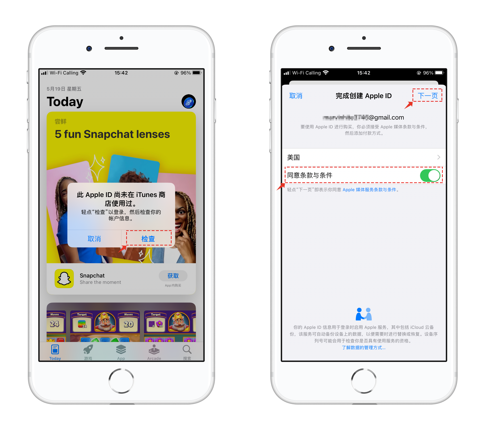
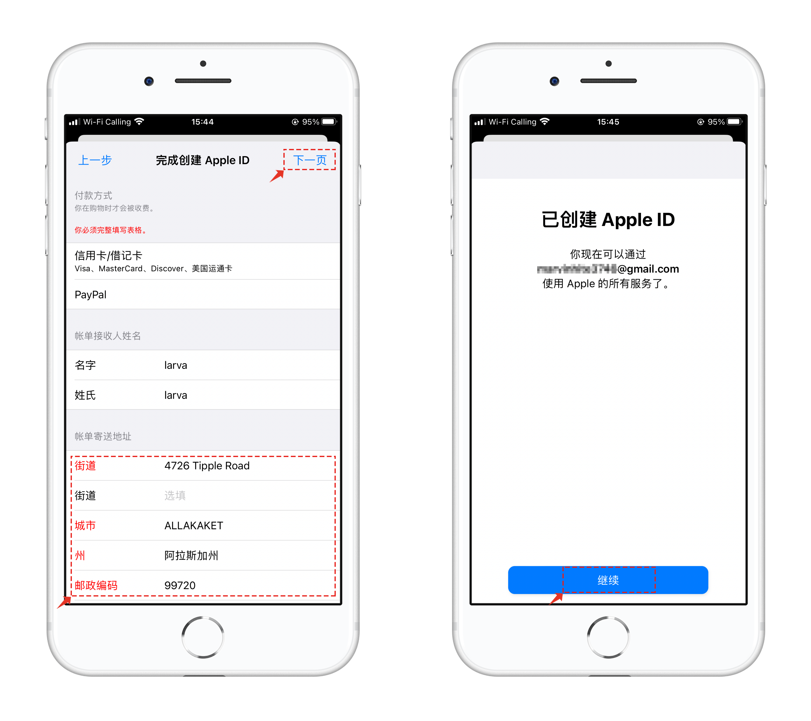

# 如何注册Apple ID

1、打开注册链接，可以在PC端或者手机登录([<mark style="color:blue;">**Apple ID Account**</mark>](https://appleid.apple.com/account))。

名字和姓氏要使用英文填写，国家要宣传非内地地区出生日期（年龄）要大于18岁。填写一个没有注册过Apple ID的邮箱，正常的设置密码，在这里填入内地的手机号并完成最后的图片字符验证后点击【继续】。

<figure><figcaption></figcaption></figure>

2、使用【邮箱】和【手机号】正常的接收验证码并进行验证。

<figure><figcaption></figcaption></figure>

3、完成两次验证后就进入到了账号界面，需要点击右上方的下拉箭头并选择【付款与配送】，在付款与配送界面中的第一项显示是【无付款方式】就不需要额外设置，通常都会这样默认显示。点击下方的【添加配送地址】。

<figure><figcaption></figcaption></figure>

4、页面中的内容可以用英文随便填写，省/市选择**阿拉斯加**，因为这个地区可以免税，购买App也可以免税。具体的个人信息填写可以通过网站生成：[<mark style="color:blue;">**美国身份证生成**</mark>](https://www.shenfendaquan.com/)

美区其它免税区包括：蒙大拿州（Montana）俄勒冈州（Oregon）阿拉斯加州（Alaska）特拉华州（Delaware）新罕布什尔州（New Hampshire）。

填写完成并提交后，需要发送一条**验证码验证**，然后看到配送地址填写完成的界面就完成了注册的第一个步骤。

<figure><figcaption></figcaption></figure>

5、打开App Store，选择右上角的头像并登录，登录后点击账户头像。

<figure><figcaption></figcaption></figure>

6、打开界面中会看到一个尚未使用的提示，只需要点击【检查】，在打开的界面中勾选【同意条款和条件】然后点击右上角【下一步】。

<figure><figcaption></figcaption></figure>

7、在界面中如果寄送地址没有完善就需要重新填写一下，然后点击【下一步】就可以完成所有的注册工作。

<figure><figcaption></figcaption></figure>
