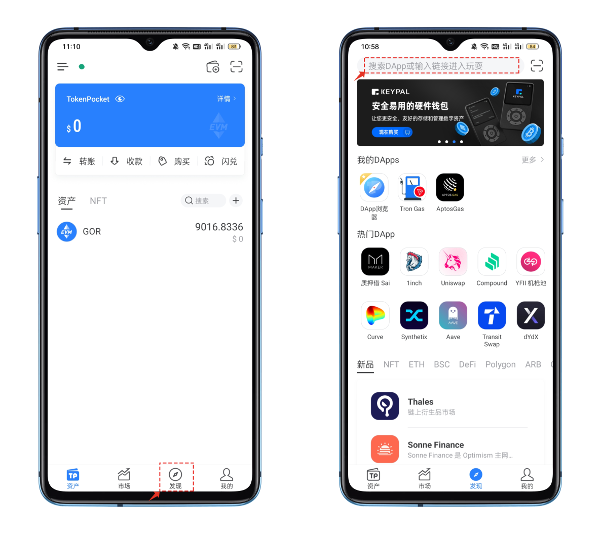
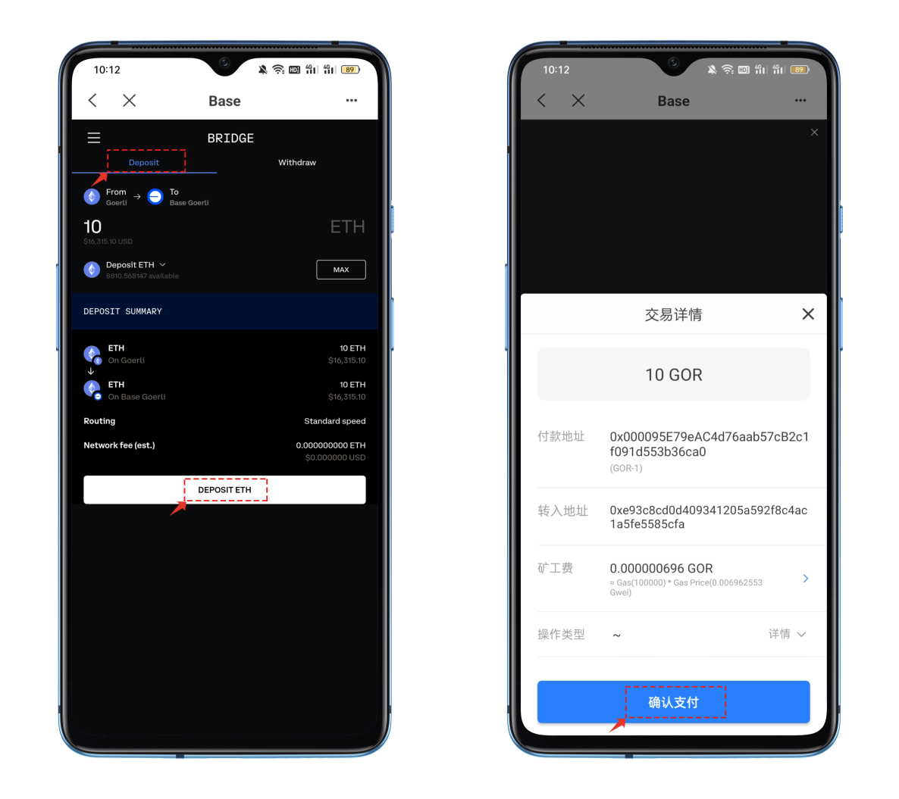
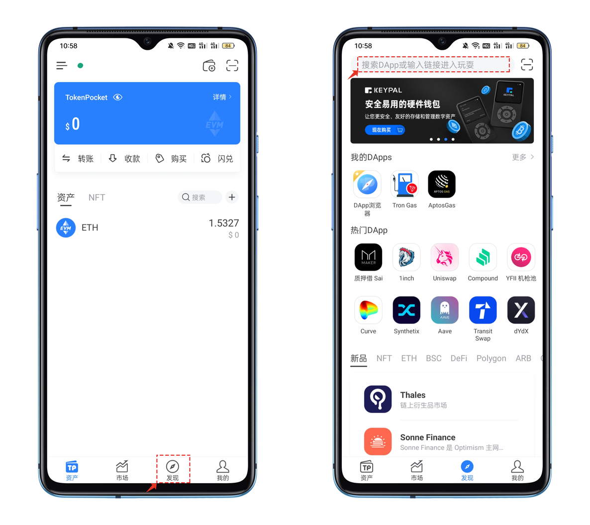
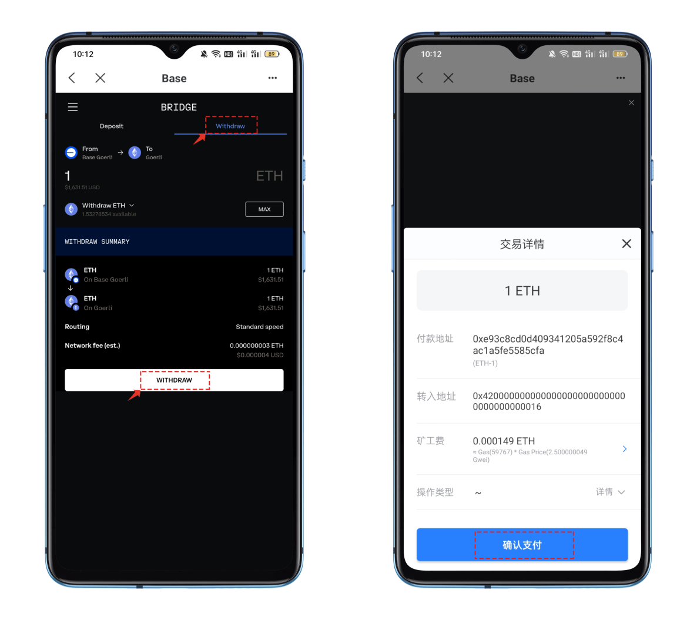

# Base Goerli公链和Goerli公链资产互通

#### Goerli 兑换 Base Goerli 代币 

一、打开Goerli 公链钱包，点击【发现】页面顶部栏中填入兑换的工具链接并打开 [https://bridge.base.org/deposit](https://bridge.base.org/deposit) 。

<figure><figcaption></figcaption></figure>

二、打开DApp会自动完成钱包连接，默认状态是Deposit ，只需要设置需要兑换的 Goerli链上需要兑换的代币数量，例如我们设置兑换数量为1.填入后点击【DEPOSIT ETH】弹出的交易界面中点击【确认支付】，代币的兑换通常需要几分钟的时间。

<figure><figcaption></figcaption></figure>

#### Base Goerli 兑换 Goerli 代币 

一、打开 Base Goerli 公链钱包，点击【发现】页面顶部栏中填入兑换的工具链接并打开 [https://bridge.base.org/deposit](https://bridge.base.org/deposit) 。

<figure><figcaption></figcaption></figure>

二、打开DApp会自动完成钱包连接，点击【Withdraw】菜单 ，设置需要兑换的 Base Goerli链上需要兑换的代币数量，例如我们设置兑换数量为1.填入后点击【Withdraw】弹出的交易界面中点击【确认支付】，代币的兑换通常需要几分钟的时间。

<figure><figcaption></figcaption></figure>
