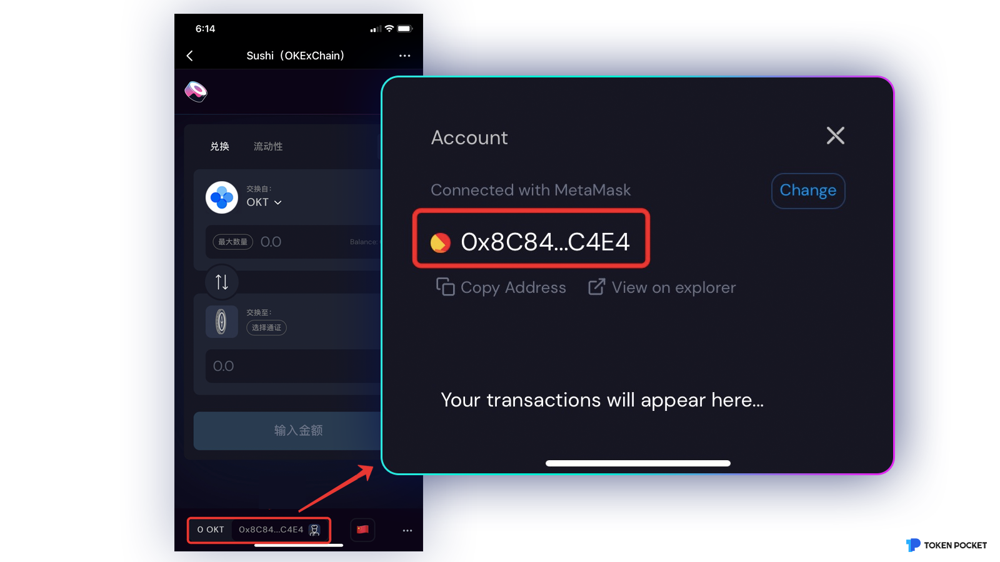
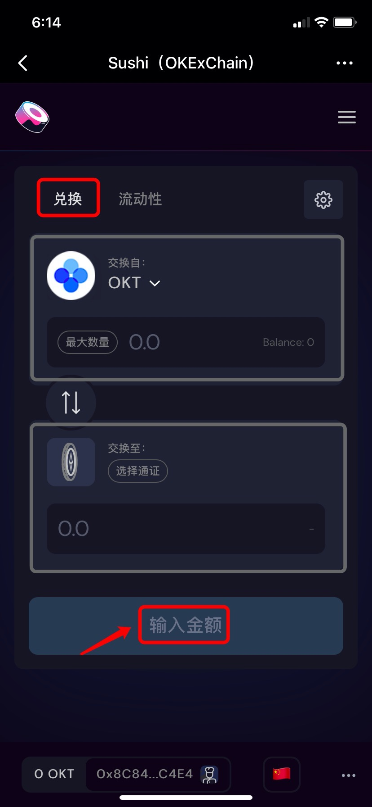
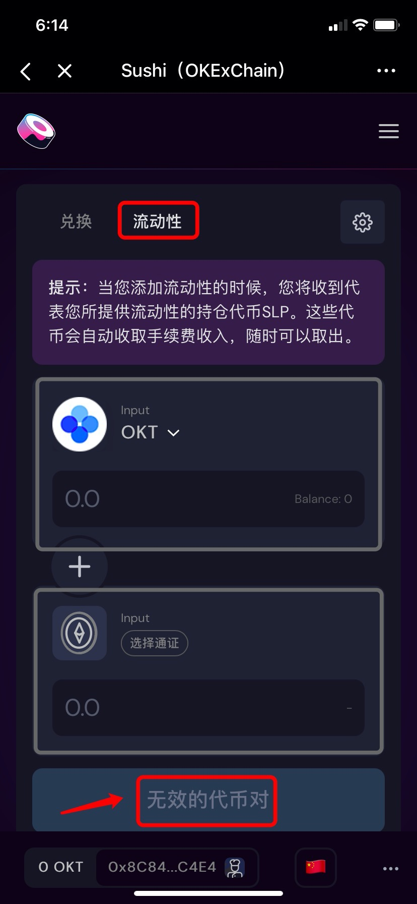

# SushiSwap（OKEX）使用教程

**关于**[**SushiSwap**](https://sushi.com/)\
Sushi是基于OKExChain的去中心化交易平台，具有【兑换】和【添加流动性】等功能。

**一、如何兑换交易？**\
1、打开TokenPocket，选择或创建OKEx的钱包，然后点击底部【发现】，在顶部输入Sushi进入页面；

2、进入页面后，左下角将默认连接钱包地址；

3、在顶部选择【兑换】，输入需要兑换的代币和接收代币，然后输入数量，最后点击【Swap】即可完成兑换。

**二、如何添加流动性？**\
1、点击顶部【流动池】，选择添加流动性的代币对和数量，然后进行授权，再点击提供流动性确认完成质押，添加流动性后可点击【查看您的LP】。


本教程仅为DApp在钱包端的操作指南，不代表TokenPocket的投资建议。投资有风险，您须充分认识风险，并自行作出投资决策。

