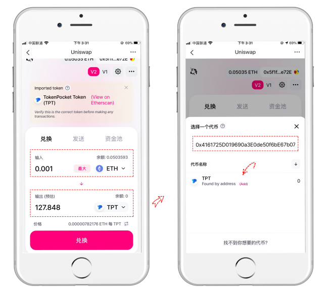
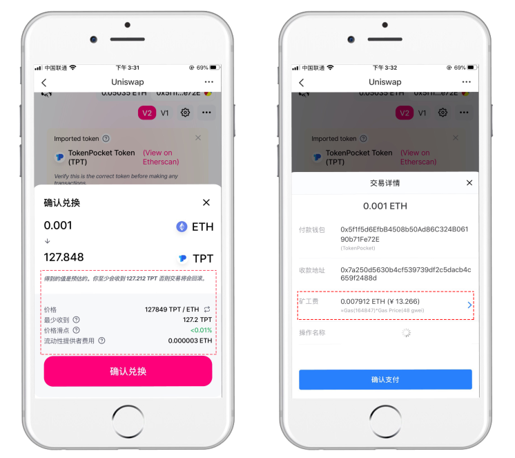
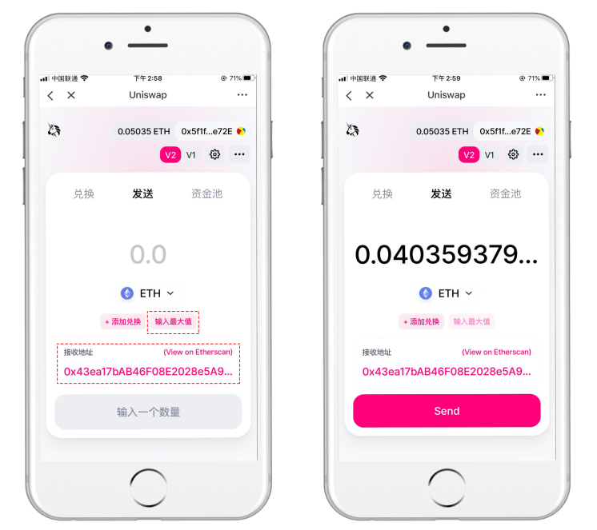
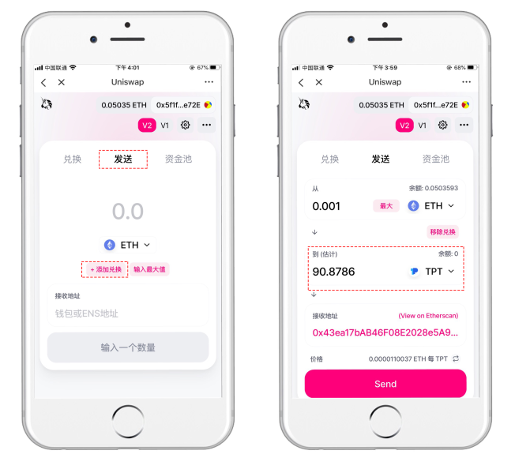
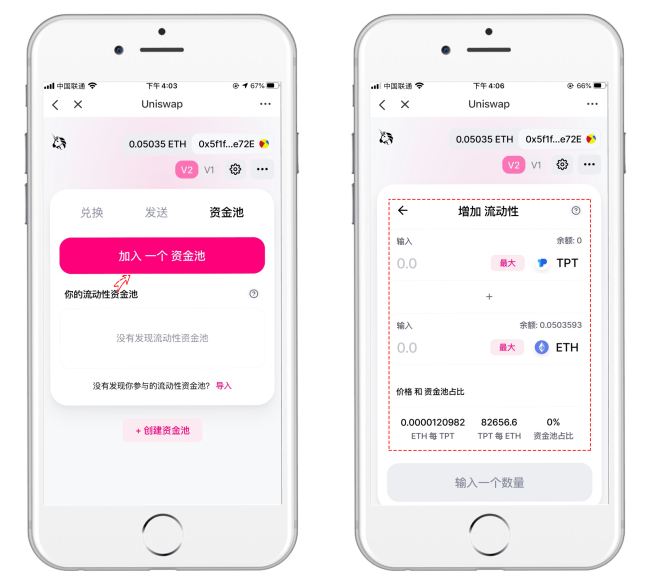

# Uniswap（以太坊）使用教程

**关于**[**Uniswap**](https://uniswap.org/)\
Uniswap从界面上属于比较干练、简约风格的，非常适合新手操作，V2和V1的版本可以非常方便的切换，把强大的功能都隐藏在了界面之后。现在已经到了V3版本，其页面也延续前两个版本的简洁风格。目前，Uniswap 仅支持以太坊钱包，

Uniswap主要有【兑换】【发送】【资金池】和V3版本新增的【Vote】功能，我们将对其交易功能进行讲解。

**一、如何兑换代币？**\
****1、打开TokenPocket，点击【发现】进入发现界面后点击顶部，搜索Uniswap，选择任意结果（V1、V2、V3）打开。（这里以Uniswap V2为操作示例）

2、打开后默认显示【兑换】界面，分别输入转出的代币和需要兑换的代币，并输入数量（输入转出数量后，兑换的数量将自动显示），然后点击【兑换】；（这里以ETH兑换TPT为例）

提示：iOS移动端暂时只能通过合约地址选择TPT ：0x4161725d019690a3e0de50f6be67b07a86a9fae1

3、查看兑换的详情内容，然后点击【确定兑换】按钮进行兑换，这里要注意gas的数值（Gas经常会有波动），最后点击【确认支付】即可完成兑换操作。

4、【发送】功能，既可以作为一个普通的代币转账工具，又可以兑换-转账一条龙服务。\
点击顶部【发送】，然后设置发送数量，也可以直接选择【输入最大值】会自动帮助预留足够的gas发送剩余代币。输入【接收地址】，最后点击【Send】即可完成发送工作。（此处以发送ETH为例）

5、这里需要提一下发送的另一个功能：添加兑换发送。点击发送界面的【添加兑换】添加一条兑换的选项，设置输入和输出的参数后点击【发送】授权后即可发送。（也适用于帮朋友直接兑换和发送代币）

**二、如何添加流动性？**\
点击顶部【资金池】-【加入一个资金池】，选择增加流动性的两个代币和数量（输入一个代币的数量后，另一个代币的数量将会自动显示），存入资金池从而增加更好的代币流动性，以此可获得手续费收益。


本教程仅为DApp在钱包端的操作指南，不代表TokenPocket的投资建议。投资有风险，您须充分认识风险，并自行作出投资决策。


