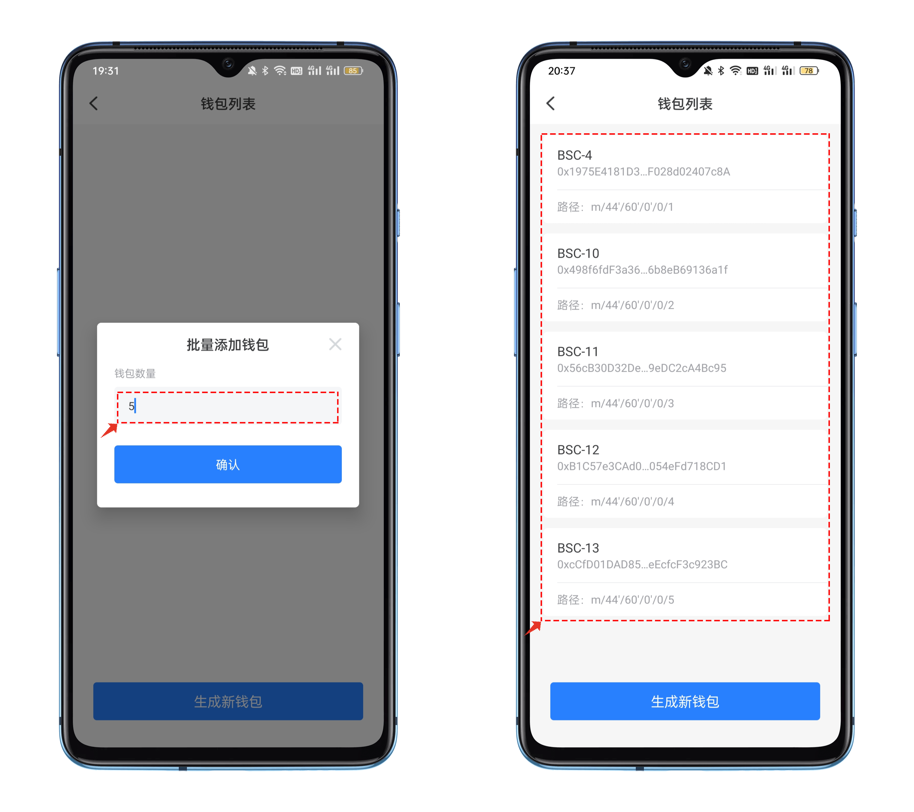

# Uniswap使用教程

**关于**[**Uniswap**](https://uniswap.org/)\
Uniswap从界面上属于比较干练、简约风格的，非常适合新手操作，现在已经到了V3版本，其页面也延续前两个版本的简洁风格。目前，Uniswap 已支持包括以太坊、BSC、Arb等公链。

<figure><figcaption></figcaption></figure>

### <mark style="color:orange;">**Uniswap使用教程**</mark> 

1、打开TokenPocket，点击【发现】进入发现界面后在推荐位中打开或点击顶部，搜索Uniswap。

<figure><figcaption></figcaption></figure>

2、打开后默认显示【兑换】界面，分别输入转出的代币和需要兑换的代币，并输入数量（输入转出数量后，兑换的数量将自动显示），然后点击【兑换】；

点击选择代币会打开选择界面，在这里填入代币名称或输入合约地址查询代币，建议使用合约地址查询，结果更准确。

3、查看兑换的详情内容，然后点击【确定兑换】按钮进行兑换，这里要注意gas的数值（Gas经常会有波动）如果是想快速成交，可以点击矿工费选项选择“快”选项或者自定义增加Gwei。最后点击【确认支付】即可完成兑换操作。

4、在Uniswap底部菜单中，还可以点击【代币】、【NFTs】、【流动池】等功能，可以查看一些实时的数据。

.png>)

5、点击顶部【资金池】可以选择查看已经参与的历史数据，或点击【新仓位】加入，（输入一个代币的数量后，另一个代币的数量将会自动显示），存入资金池从而增加更好的代币流动性，以此可获得手续费收益。在Uniswap界面中还可以点击右上角的设置功能来进行调整相关参数。


本教程仅为DApp在钱包端的操作指南，不代表TokenPocket的投资建议。投资有风险，您须充分认识风险，并自行作出投资决策。

