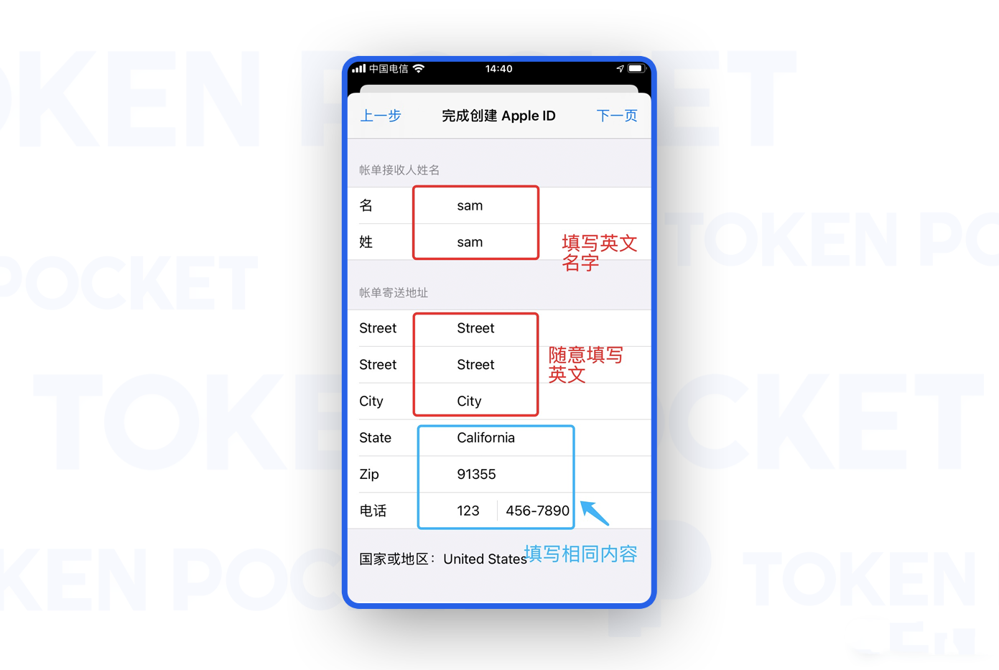
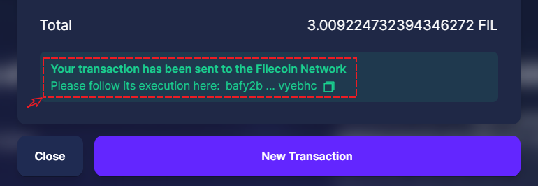

# FIL代币从主网转移到FEVM链

### <mark style="color:orange;">通过Binance购买ETH代币</mark>

在Binance中购买的FIL暂时是可以支持主网代币，所以我们需要先获取一些FIL主网代币，然后通过第三方的工具迁移到FEVM链。

<figure><figcaption></figcaption></figure>

#### <mark style="color:orange;">闪兑方式：</mark>

1、打开binance官网，选择左上角【交易】菜单，选择【闪兑】，闪兑方式是为了方便新用户操作的一种简化图形界面，在这里可以选择【市价】或【限价】交易方式，填入需要兑换的代币数量，点击底部的【预览兑换结果】。

<figure><figcaption></figcaption></figure>

2、兑换界面中可以看到兑换的比例、手续费等参数，点击兑换（因为是市价交易，所以会有8秒钟的交易时间限制）。

<figure><figcaption></figcaption></figure>

3、兑换完成后，可以在界面中看到成功的提示。

<figure><figcaption></figcaption></figure>

#### <mark style="color:orange;">如何创建FIL主网钱包</mark>

1、打开[<mark style="color:blue;">**https://www.glif.io/**</mark>](https://www.glif.io/)点击右侧【Connect Wallet】

<figure><figcaption></figcaption></figure>

2、选择【Burner Wallet】。

<figure><figcaption></figcaption></figure>

3、点击创建钱包。

<figure><figcaption></figcaption></figure>

4、默认提供了24位的助记词，请务必妥善备份和保存。

<figure><figcaption></figcaption></figure>

完成助记词的验证。

<figure><figcaption></figcaption></figure>

5、这个f1开头的地址就是FIL主网的地址，这个地址用于在Binance提取FIL代币。

<figure><figcaption></figcaption></figure>

#### <mark style="color:orange;">如何提取FIL到钱包</mark>

执行提币操作的时候，最重要的因素就是提币的网络选择和地址。点击转账网络，会弹出窗口提示，其中选择FIL主网网络。

<figure><figcaption></figcaption></figure>

确认好提币网络，正确填写收款地址，设置好提币数量后，就可以点击【提现】操作，耐心等待几分钟即可到账，到账的时间取决于交易所的放款速度，遇到问题可以和交易所客服进行联系。

<figure><figcaption></figcaption></figure>

#### <mark style="color:orange;">如何转出到FEVM链地址</mark>

1、提款到账后，点击右上角地址栏，下拉选择【Send FIL】

<figure><figcaption></figcaption></figure>

2、填入0x开头的FEVM钱包地址，在这里会自动解析为f4开头的地址，设置转账的数量，点击Send。在这里需要说明的是，从交易所提币的时候建议选择整数，因为这里的发送只能选择整数。

<figure><figcaption></figcaption></figure>

3、请在TokenPocket钱包中核对好收款地址的网络，打开钱包，点击收款，顶部可以看到当前钱包的网络。

<figure><figcaption></figcaption></figure>

4、发送完成后会看到发送的哈希值，可以点击查看。

<figure><figcaption></figcaption></figure>

5、接下来就是耐心等待FEVM链地址的到账，通常都在2分钟内完成到账。

