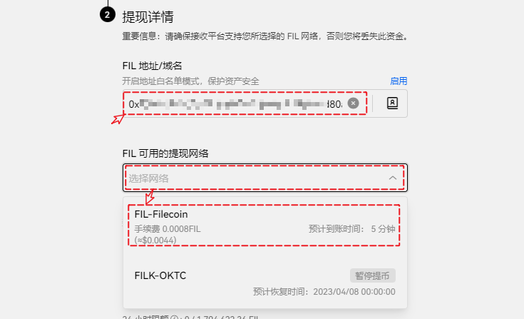

# FEVM-FIL代币的购买和提现

### <mark style="color:orange;">通过欧易交易所购买FIL代币</mark> 

在交易购买FIL的途径可以使用欧易交易所交易菜单中的【闪兑】和【基础交易】，我们本次演示使用闪兑的方式来快捷完成代币的兑换和FIL代币的提币。

<figure><figcaption></figcaption></figure>

#### <mark style="color:orange;">闪兑获取FIL代币</mark> 

打开闪兑界面，默认会选择【数字货币】选项，首先选择需要兑换消耗的代币和获得的代币，例如这里的USDT兑换FIL代币；设置完代币填入需要兑换的数量，点击【兑换为FIL】。

<figure><figcaption></figcaption></figure>

确认兑换界面可以查看到兑换的方向和预估值等信息，点击【确认】。

<figure><figcaption></figcaption></figure>

#### <mark style="color:orange;">提取代币到钱包</mark> 

进入到【提现】界面，在币种搜索栏中点击并填入FIL，选择FIL代币。

<figure><figcaption></figcaption></figure>

默认选择【链上提现】点击下一步。

<figure><figcaption></figcaption></figure>

在提现详情界面，填入需要收款的0x开头的地址，在提现网络中选择FIL网络，这里没有单独列出FEVM网络选项。

<figure><figcaption></figcaption></figure>

提款地址和提款网络选择完成后就可以设置提现的数量，可以查看到提现的手续费用数量，点击下一步。

<figure><figcaption></figcaption></figure>

在【安全验证】界面中再次核对收款地址，确认无误后即可使用邮箱短信验证码或谷歌验证码方式来进行验证。

<figure><figcaption></figcaption></figure>
