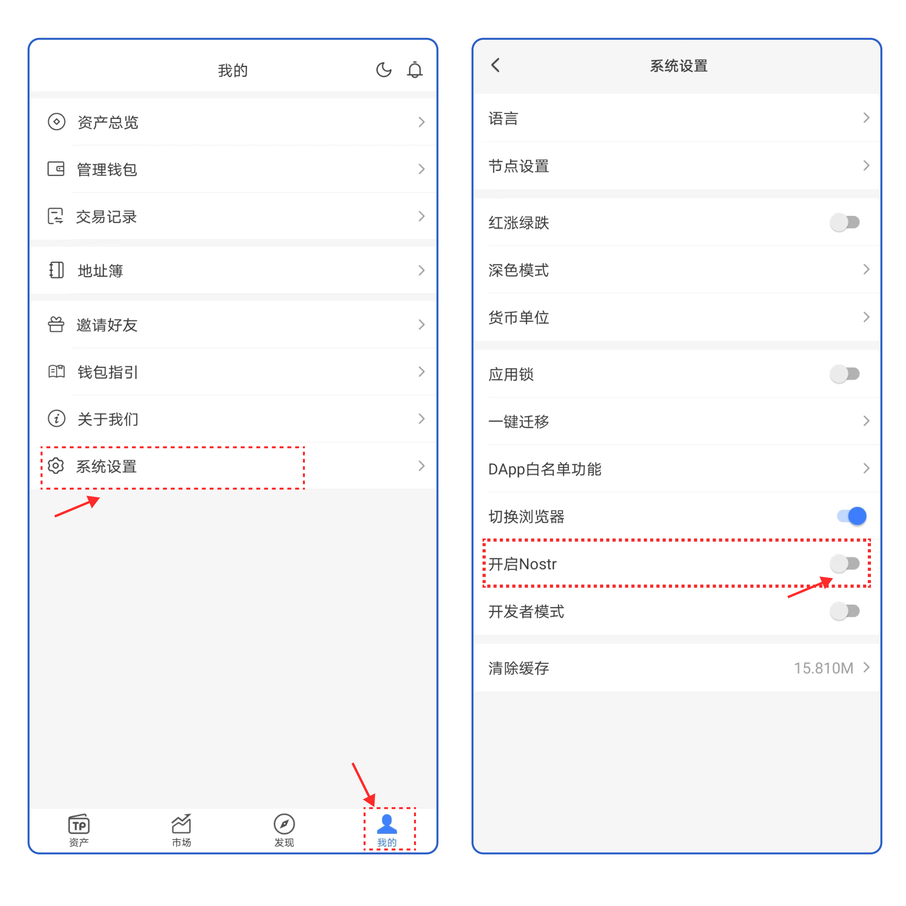
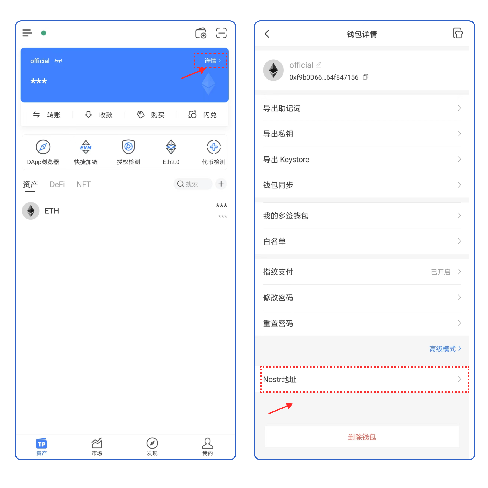
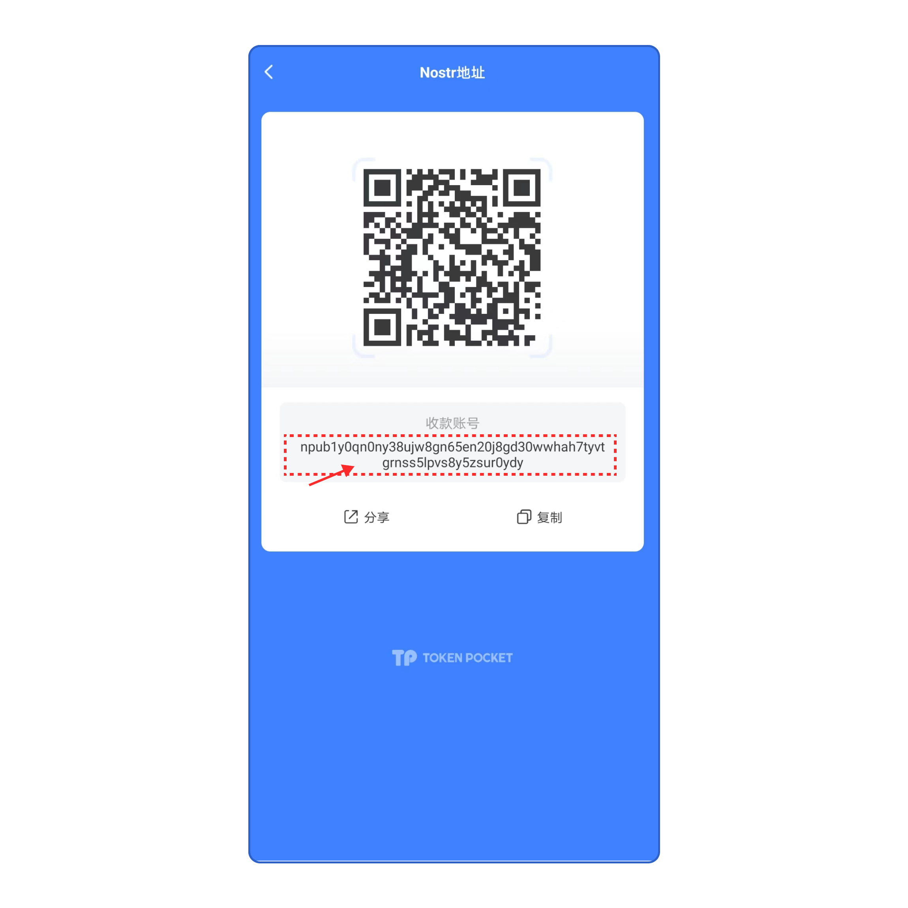
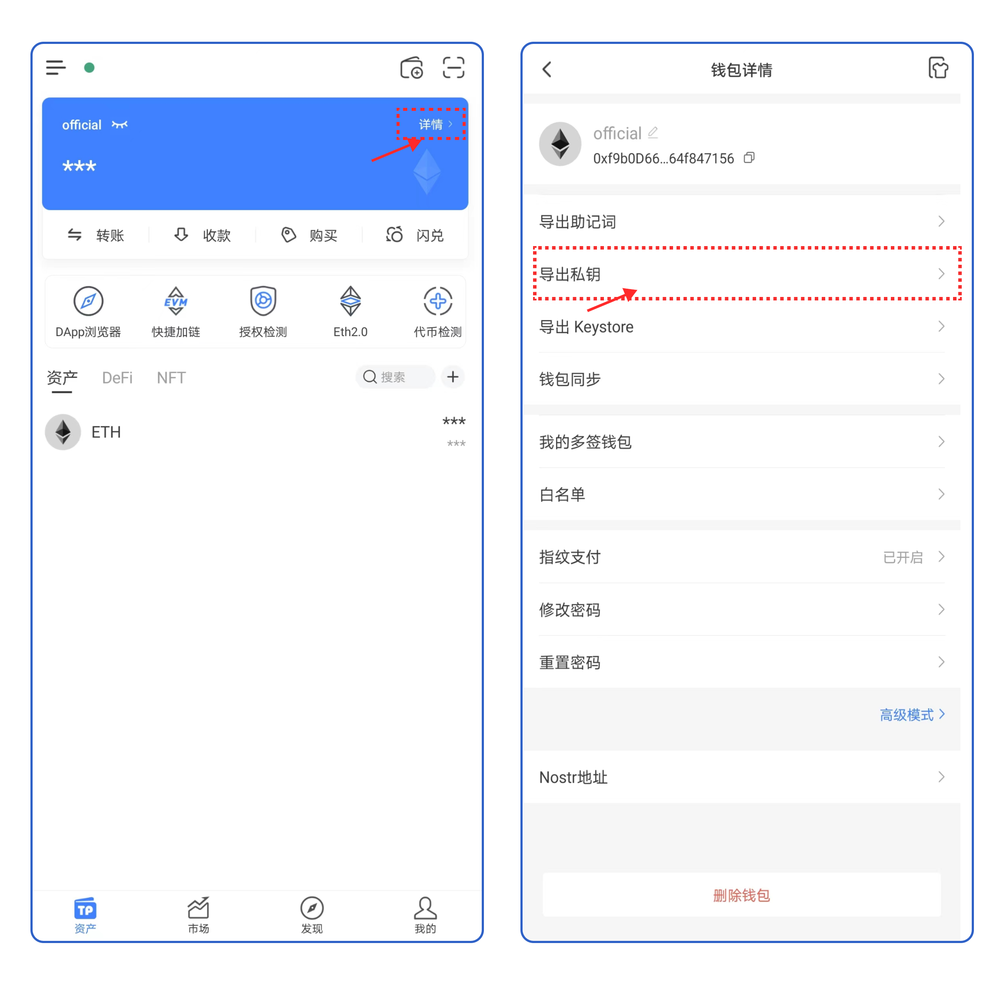
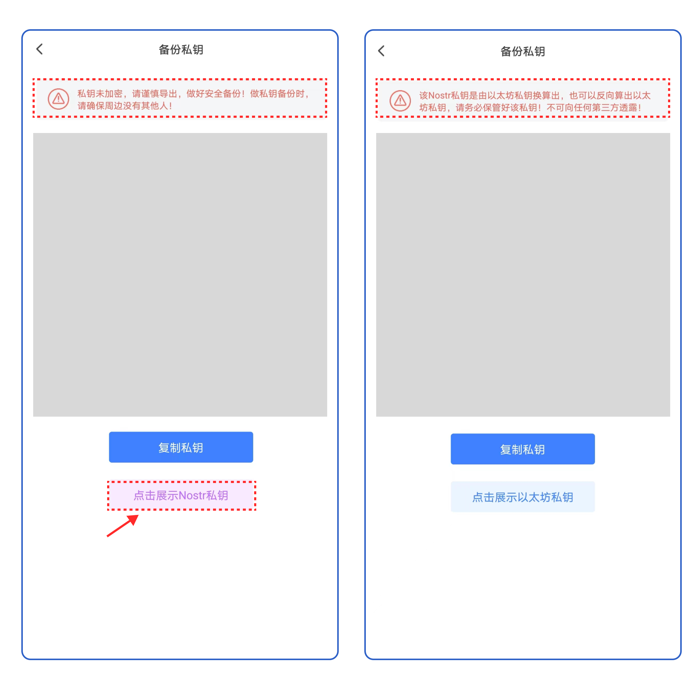

# 关于Nostr协议

### <mark style="color:orange;">什么是Nostr协议？</mark>

Nostr（Notes and Other Stuff Transmitted by Rrelays）是一款简洁、开源的去中心化社交协议。

<mark style="color:orange;"></mark>

### <mark style="color:orange;">如何在TokenPocket开启Nostr?</mark>

1. 目前， TokenPocket已支持Nostr协议（安卓端请更新到1.7.0及以上版本）。点击【我的】，打开【开启Nostr】的开关，即可开启Nostr。

<figure><figcaption></figcaption></figure>

### <mark style="color:orange;">如何获取Nostr地址？</mark>

1. 打开TokenPocket钱包，切换至资产页面，点击右上角【详情】，点击【Nostr】即可获取Nostr地址。

<figure><figcaption></figcaption></figure>

2.你将在该页面看到以【npu】开头的Nostr地址。

<mark style="color:red;">**请注意，目前并未支持Nostr地址转账，请勿在转账过程中使用该地址执行转账操作。**</mark>

<figure><figcaption></figcaption></figure>

### <mark style="color:orange;">如何获取Nostr私钥？</mark>

1.打开TokenPocket钱包，切换至资产页面，点击右上角【详情】，点击【导出私钥】。

<figure><figcaption></figcaption></figure>

2.点击【点击展示Nostr私钥】按钮即可查看当前evm钱包的Nostr私钥。

<mark style="color:red;">**请注意，该Nostr私钥是由对应evm地址的私钥换算出来的，同时也可以方向换算出evm地址的私钥，请务必保管好该私钥！不要和任何第三方分享你的私钥！**</mark>

<mark style="color:red;">**请注意，该Nostr私钥是由对应evm地址的私钥换算出来的，同时也可以方向换算出evm地址的私钥，请务必保管好该私钥！不要和任何第三方分享你的私钥！**</mark>

<mark style="color:red;">**请注意，该Nostr私钥是由对应evm地址的私钥换算出来的，同时也可以方向换算出evm地址的私钥，请务必保管好该私钥！不要和任何第三方分享你的私钥！**</mark>

<figure><figcaption></figcaption></figure>
