# 如何自主更新代币图标？

提交代币图标时，请根据代币类型在[Github](https://github.com/TP-Lab/tokens)上选择相应的链接，然后提交代币图标和信息文件（注意：如未提交代币信息文件将无法通过）：‌

Ethereum：[https://github.com/TP-Lab/tokens/tree/master/eth](https://github.com/TP-Lab/tokens/tree/master/eth)​‌

BSC：[https://github.com/TP-Lab/tokens/tree/master/bsc](https://github.com/TP-Lab/tokens/tree/master/bsc)​‌

HECO：[https://github.com/TP-Lab/tokens/tree/master/heco](https://github.com/TP-Lab/tokens/tree/master/heco)​‌

TRON：[https://github.com/TP-Lab/tokens/tree/master/tron](https://github.com/TP-Lab/tokens/tree/master/tron)​‌

EOS：[https://github.com/TP-Lab/tokens/tree/master/eos](https://github.com/TP-Lab/tokens/tree/master/eos)​‌

HSC：[https://github.com/TP-Lab/tokens/tree/master/hsc](https://github.com/TP-Lab/tokens/tree/master/hsc)‌

\*\*\*\*

### **所需资料如下：**‌

**1.代币图标**


```text
文件扩展名：png，请勿大写PNG
文件名称：logo.png
大小：256px X 256px
图标背景：推荐使用透明背景‌
```


提示：你可以使用以下工具裁剪图标大小： 

1）[onlinepngtools](https://onlinepngtools.com/resize-png) 可将图片大小裁剪为 256 x 256‌

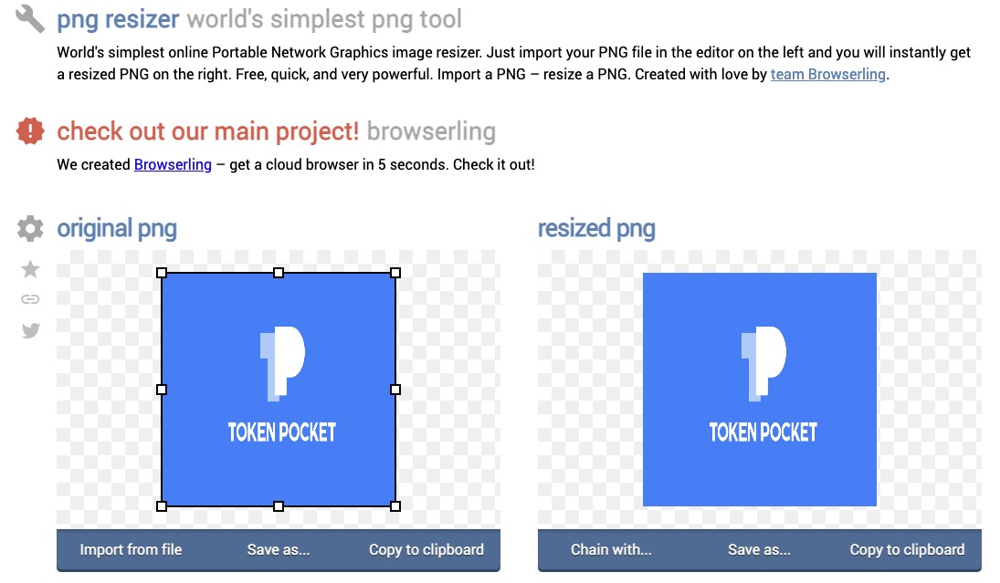

2）[TinyPNG](https://tinypng.com/) 可压缩优化图片大小


​‌

**2. 代币信息文件**


```text
文件扩展名：json，请勿大写JSON
文件名称：info.json
```


内容： info.json文件中必须包含以下信息，请确保详细信息正确无误并遵循格式要求。合约地址应遵循checksum地址格式（请参考下面的示例）。

```text
{
 "name": "TokenPocket Token",
 "website": "https://tokenpocket.pro",
 "description": "A leading multi-chain wallet that supports BTC, ETH, BSC, HECO, TRON, EOS, OKExChain, HSC and so on.",
 "explorer": "https://bscscan.com/token/0xeca41281c24451168a37211f0bc2b8645af45092",
 "type": "BEP20",
 "symbol": "TPT",
 "decimals": 4,
 "status": "active",
 "id": "0xeca41281c24451168a37211f0bc2b8645af45092"
}
```

\*\*\*\*

**3. 使用checksum格式的合约地址**

Checksum地址是指在以太坊网络中包含大写和小写字母的合约地址。你可以通过在[以太坊浏览器](https://cn.etherscan.com/)搜索代币的合约地址，搜索完成后，在左上角的地址即为checksum格式的合约地址。例如USDT的checksum格式的合约地址为：  
0x6B175474E89094C44Da98b954 EedeAC495271d0F。

或者可以点击[转换工具](https://piyolab.github.io/sushiether/RunScrapboxCode/?web3=1.0.0-beta.33&code=https://scrapbox.io/api/code/sushiether/web3.js_-_Ethereum_%E3%81%AE%E3%82%A2%E3%83%89%E3%83%AC%E3%82%B9%E3%82%92%E3%83%81%E3%82%A7%E3%83%83%E3%82%AF%E3%82%B5%E3%83%A0%E4%BB%98%E3%81%8D%E3%82%A2%E3%83%89%E3%83%AC%E3%82%B9%E3%81%AB%E5%A4%89%E6%8F%9B%E3%81%99%E3%82%8B/demo.js)把合约地址转换为checksum格式的地址。

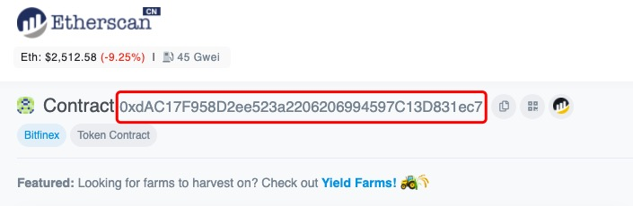

\*\*\*\*

**收费流程：**   
提交代币图标需收取100 TPT费用，请在资料准备完成后，按照以下步骤转账（此处以币安智能链钱包为例）：‌

1. 打开TokenPocket App，点击底部【资产】，选择TPT，进入页面后点击【转账】；  
****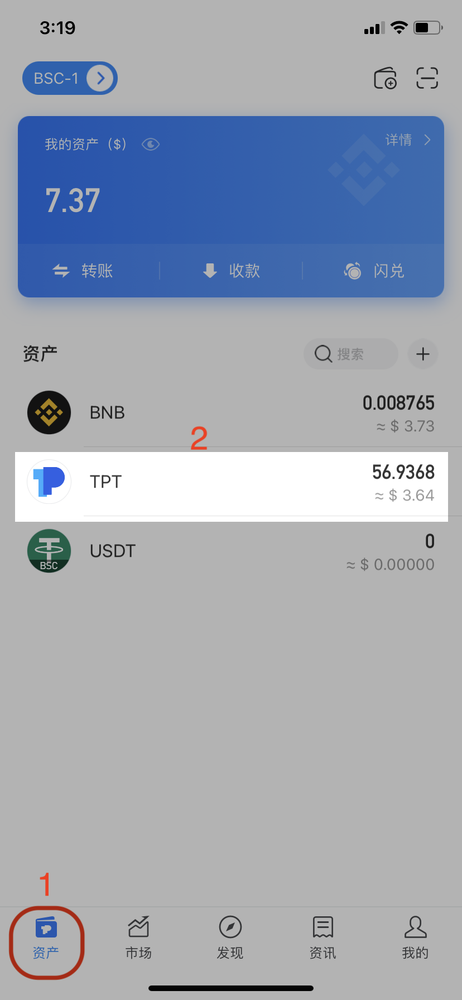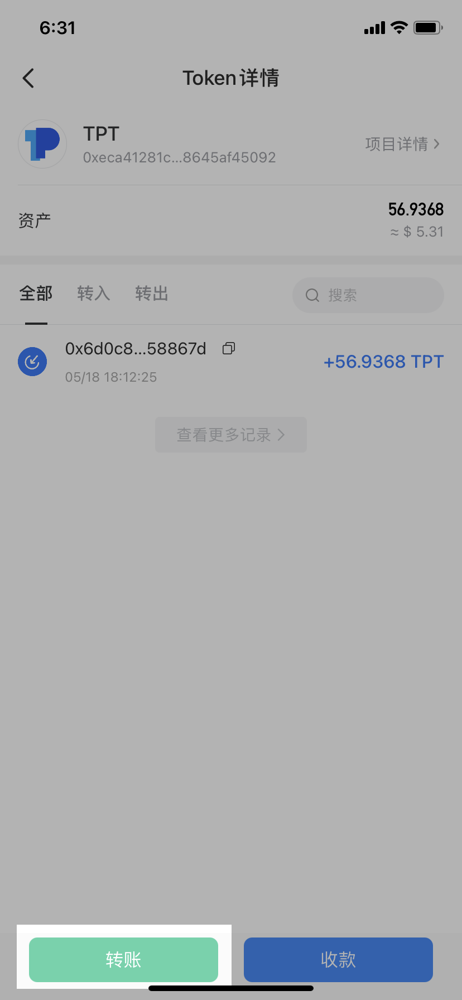‌

2. 点击【直接转账】进入页面，输入收款账号和100 TPT数量，然后选择矿工费，点击【确认】，确认信息无误后点击【确认支付】完成100 TPT的转账。‌

**注意：**收款地址为 **0x7837AE9E4FD6E967F1B8C8824D6288ECE6e730F9** （可底下扫码获取）。仅支持收取BSC、HECO以及ETH链上的TPT，请转账前再三确认！ 

 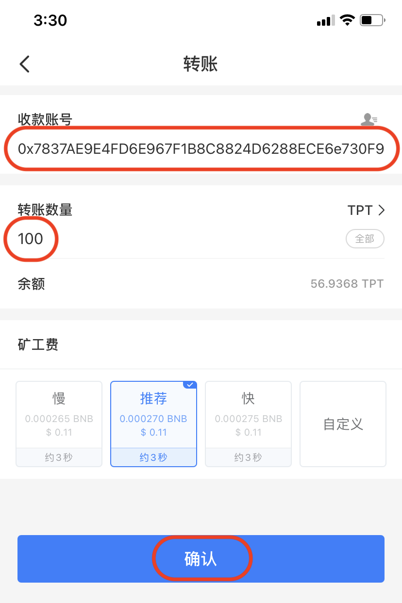 

3. 完成100 TPT的转账后，返回【资产】页面，选择BNB，然后点击【直接转账】进入转账页面；‌

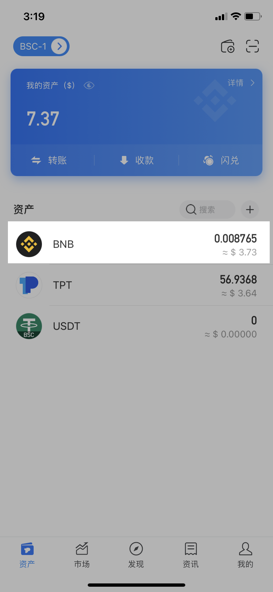

4. 输入收款地址（同上）和0 BNB数量（如果遇到未支持0 BNB转账的情况，则可以转非常小的BNB数值替代），选择矿工费后点击右下角的【高级设置】- 【纯文本】，按照格式要求填入文本，然后点击【确认】。‌

（**格式要求：**提交代币图标的链 - 提交的代币名称 - 提交的代币合约 - 支付100 TPT的哈希链接）  ‌

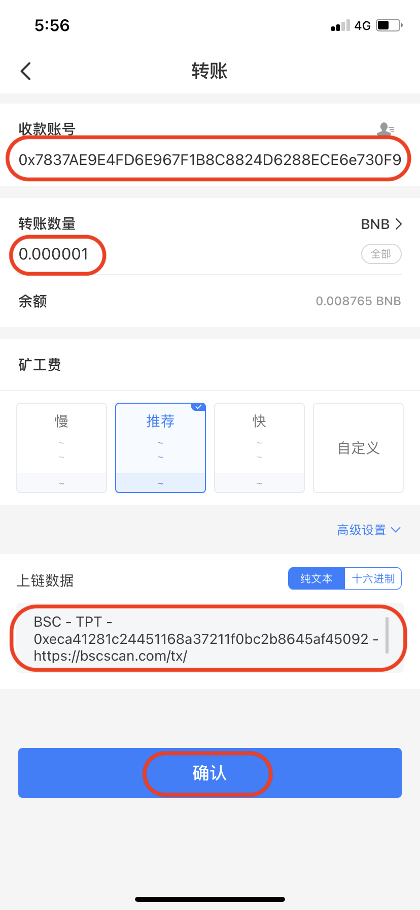

5. 再次核对转账信息，确认无误后点击【确认支付】完成付款。

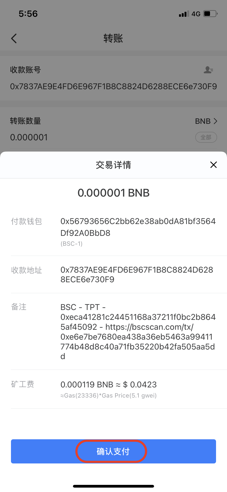

### \*\*\*\*

### **提交代币图标步骤：**

以上资料完成后，便可在GitHub上添加代币图标和信息文件**。**

1. 创建一个以代币的合约地址（checksum 格式）命名的文件夹，然后将info.json 和 logo.png添加至该文件夹；‌

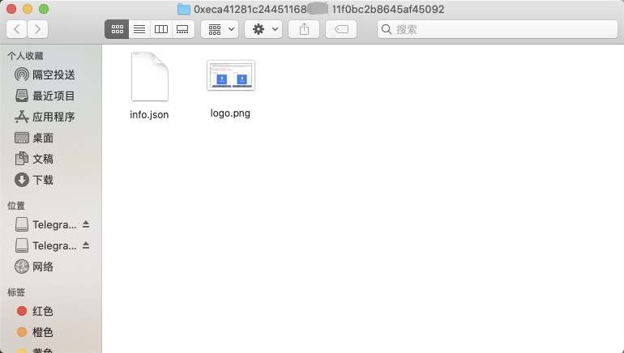

2. 打开浏览器，进入[GitHub](https://github.com/TP-Lab/tokens)，点击右上角【Fork】后等待创建；

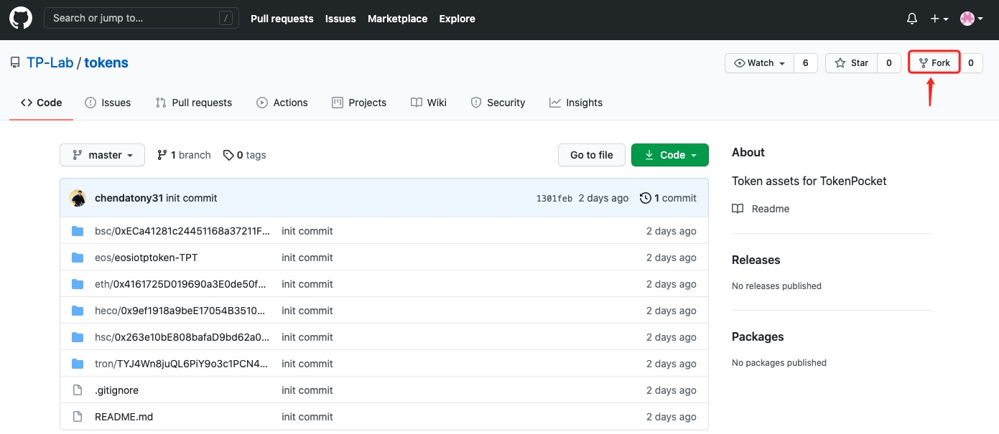

3. 根据你的代币类型选择文件（此处以选择BSC链为例），请勿关闭此页面；‌

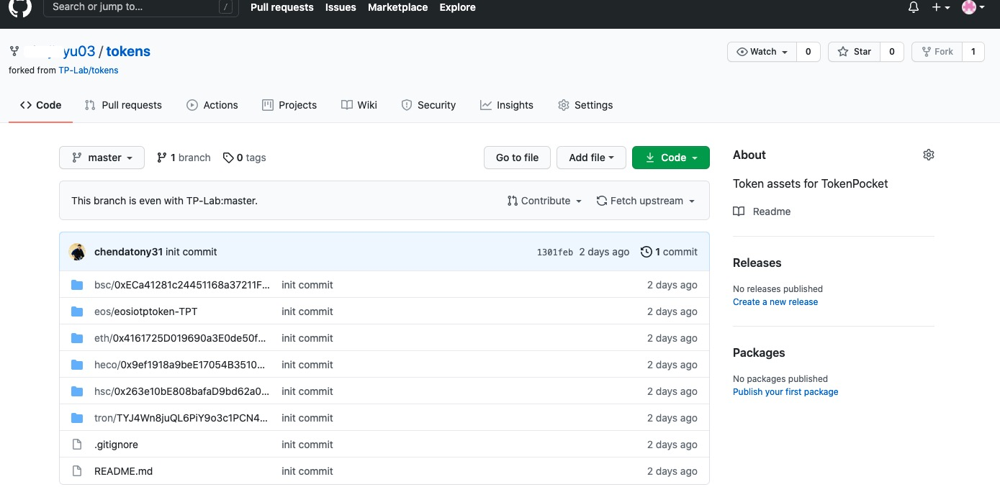

4. 将步骤1创建的文件夹拖拽至步骤4的页面；‌

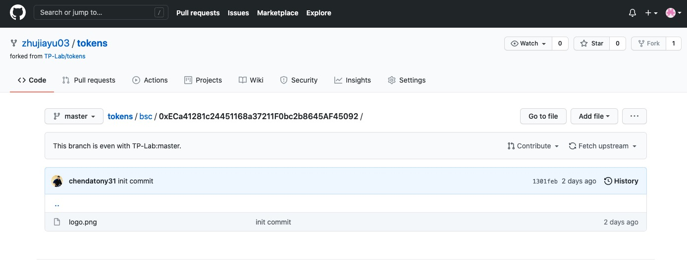

5. 在【Commit changes】处填写代币信息和其他描述，然后点击【Commit changes】；‌

**注意：**请在内容描述中添加 100TPT 的交易ID链接，否则无法通过审核。

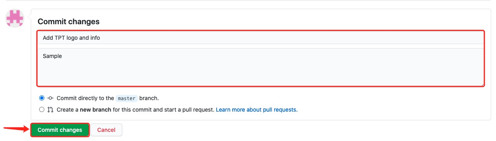

6. 页面将自动返回至上一级，然后点击【Pull requests】‌；

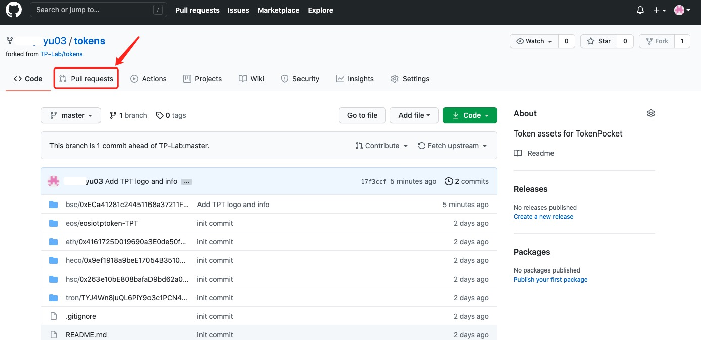

7. 点击【Creat a pull request】；‌

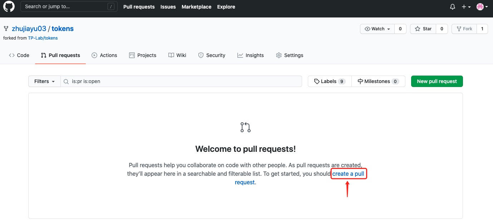

8. 页面将显示你所提交的详细资料，然后点击【Creat pull request】；‌

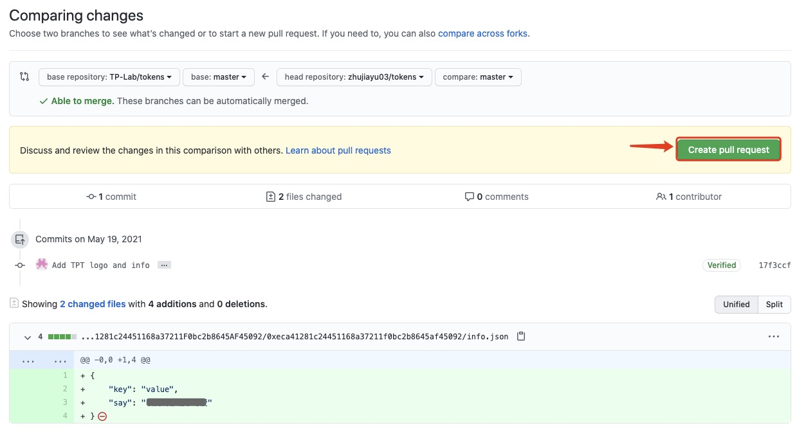

9. 输入标题和内容后，点击【Create pull request】；‌

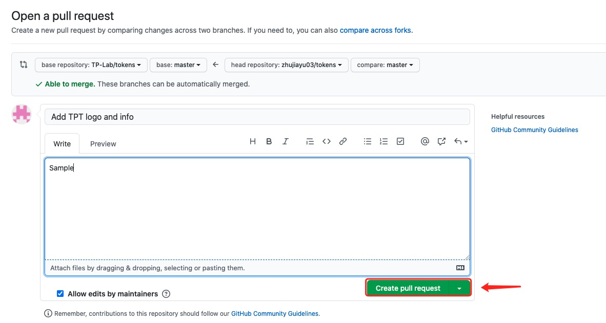

10. 至此，你已经成功提交了你的Pull request，管理员将尽快审核你的请求。‌

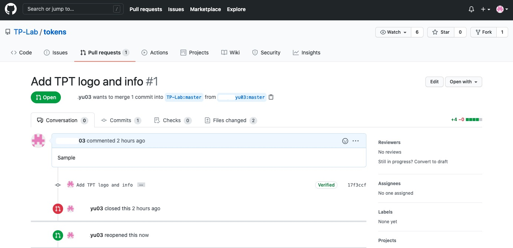

\*\*\*\*

### **如何通过申请？**‌

Pull request在添加到Tokens原仓库之前，需对其进行筛选。因此，请查看你提交的申请是否满足以下要求：‌

1. 已经支付100 TPT的手续费
2. 代币项目不存在仿冒或欺诈性行为
3. 详细的代币信息

**免责声明**‌  
****TokenPocket团队允许任何人向原仓库提交代币申请。 但是，这并不意味着我们与所有项目都有直接的合作关系。‌

经仔细审查后，如发现具有欺诈性的项目，TokenPocket团队将予以拒绝。 由于市场状况多变，如发现任何具有欺诈风险或其他危险因素，TokenPocket团队保留随时更改条款的权利。

**​**‌

### **审核时间需要多久？**‌

管理员在进一步验证后，将在**5个工作日内**完成Pull request的合并。 如果有任何其他需要或需更改的地方，将以链上信息为准进行订正。‌

管理员将Pull request合并后，代币的图标即可更新。**请勿重复提交Pull request !** 感谢你的耐心等待。[  
](https://app.gitbook.com/@tokenpocket-gm/s/tutorial-series/~/drafts/-M_yHrzLg8i88f4fnBpi/the-usage-tutorial-of-okexchain-test-okex)

